# Docker COmpose 

## Intro 


## Compose file version 


### link for version of file 

[version](https://docs.docker.com/compose/compose-file/)

## Compose version 

```
❯ docker-compose  -v
docker-compose version 1.29.1, build c34c88b2

```

### Docker compose file view 


### Example 1 

```
version: "3.8"
networks: # if you want to create your own bridge 
 ashubrx1122:  # name of Bridge to be created 
#volumes:
services:
    ashuapp1: # name of service
     image: alpine
     command: ping fb.com
     container_name: ashuc1  
     networks: # to use network created in above section 
        - ashubrx1122 # name of bridge 

```

### RUnning file 

```
docker-compose up -d

❯ docker-compose ps
 Name      Command     State   Ports
------------------------------------
ashuc1   ping fb.com   Up      

```

### compose commands are similar to docker 

```
❯ docker-compose  images
Container   Repository    Tag       Image Id       Size  
---------------------------------------------------------
ashuc1      alpine       latest   6dbb9cc54074   5.613 MB

docker-compose  logs 


===

❯ docker-compose stop
Stopping ashuc1 ... done
❯ docker-compose  ps
 Name      Command      State     Ports
---------------------------------------
ashuc1   ping fb.com   Exit 137   


===

❯ docker-compose  start
Starting ashuapp1 ... done
❯ docker-compose  ps
 Name      Command     State   Ports
------------------------------------
ashuc1   ping fb.com   Up         


```


### cleanup 

```
❯ docker-compose down
Stopping ashuc1 ... done
Removing ashuc1 ... done
Removing network ashuapp123_ashubrx1122

```


### history

```
10016* docker-compose up  -d
10017* docker-compose ps
10018  docker-compose ps 
10019  cd ashuapp123
10020  ls
10021  docker-compose ps
10022  docker-compose  images
10023  docker-compose  logs 
10024  history
10025  docker-compose stop 
10026  docker-compose  ps
10027  docker-compose  start
10028  docker-compose  ps
10029  ls
10030  mv  docker-compose.yaml  ashu.yml
10031  ls
10032  docker-compose ps
10033  docker-compose -f  ashu.yml ps 
10034  ls
10035  history
10036  docker-compose -f  ashu.yml ps 
10037  mv  ashu.yml docker-compose.yaml
10038  docker-compose ps 
10039  docker-compose down 

```

### Multiple service in compose 

```
version: "3.8"
volumes: # creating volume 
    ashudbvol: 
services:
    ashuapp1: # name of service
     image: alpine
     command: ping fb.com
     container_name: ashuc1  
    ashuapp2: # name of service 
     image: nginx
     container_name: ashuc2
     ports:
        - "1234:80"
    ashudbsvc1: # name of service
     image: mysql
     container_name: ashuc3
     environment:
        MYSQL_ROOT_PASSWORD: "CiscoDb099"
     volumes: # using volumes 
        - ashudbvol:/var/lib/mysql/
      

```


## Docker Engine is not a good fit to deploy production grade application issues 

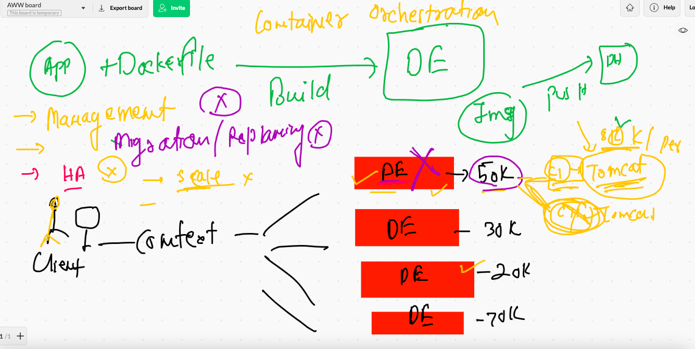

## Container orchestration tools 

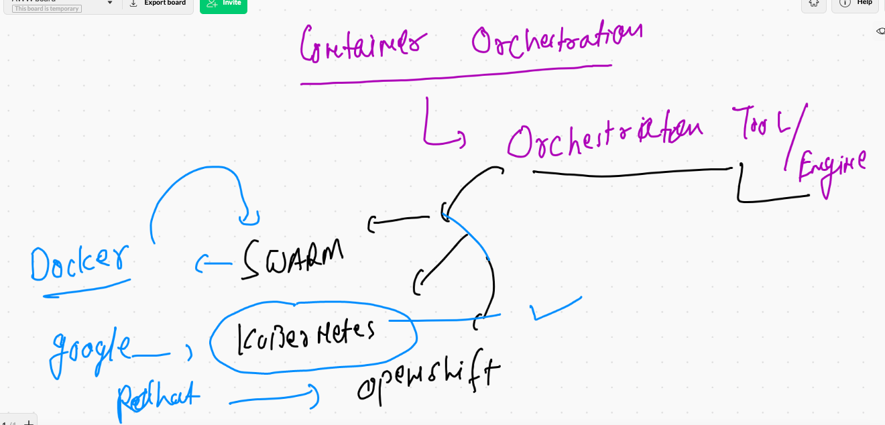

## K8s info 

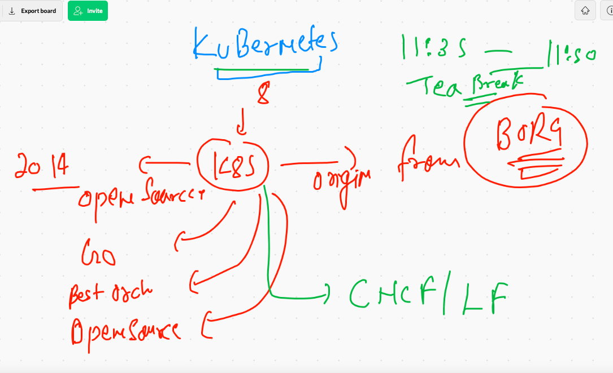

## K8s architecuter 

### hardware 

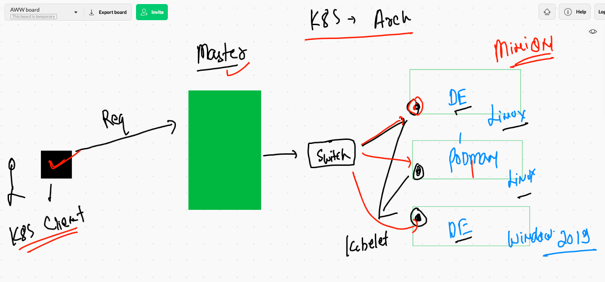

## Master Node COmponents 

### KUbe-apiserver 

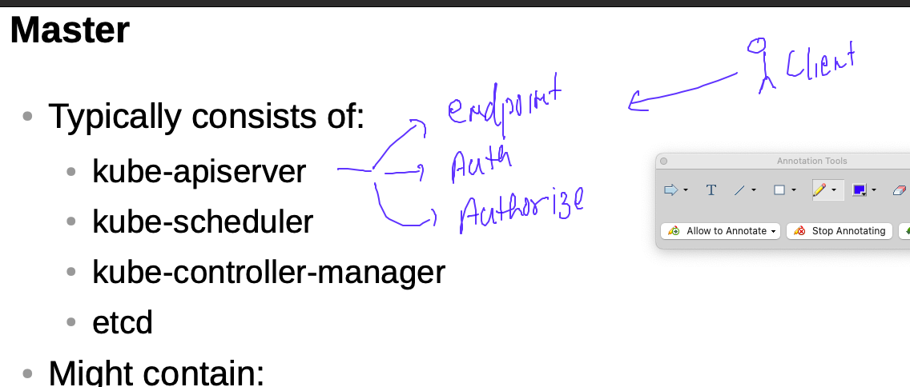

### KUbenetes client 

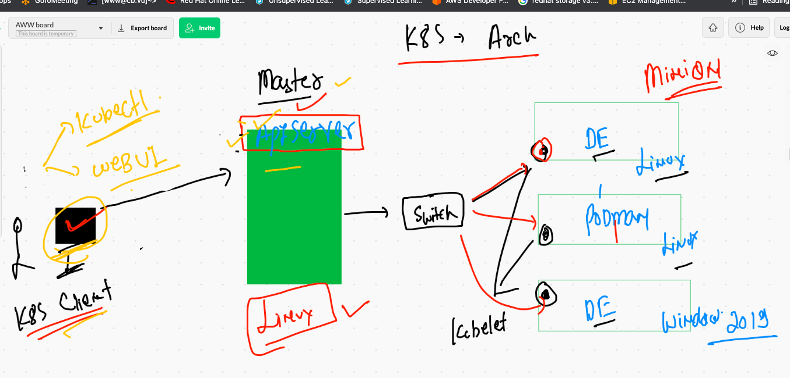

### kube-schedular 

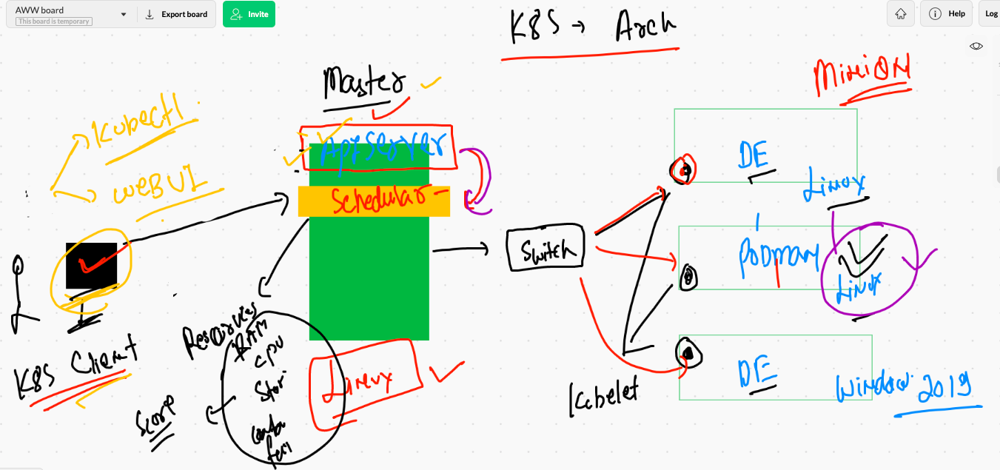

### kube-controller-manager 

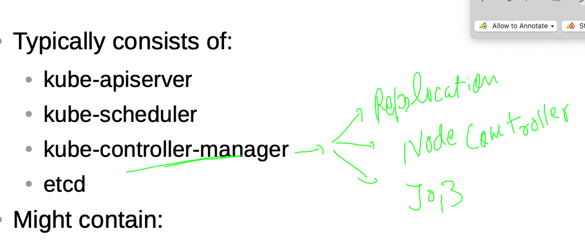

### Node controller 

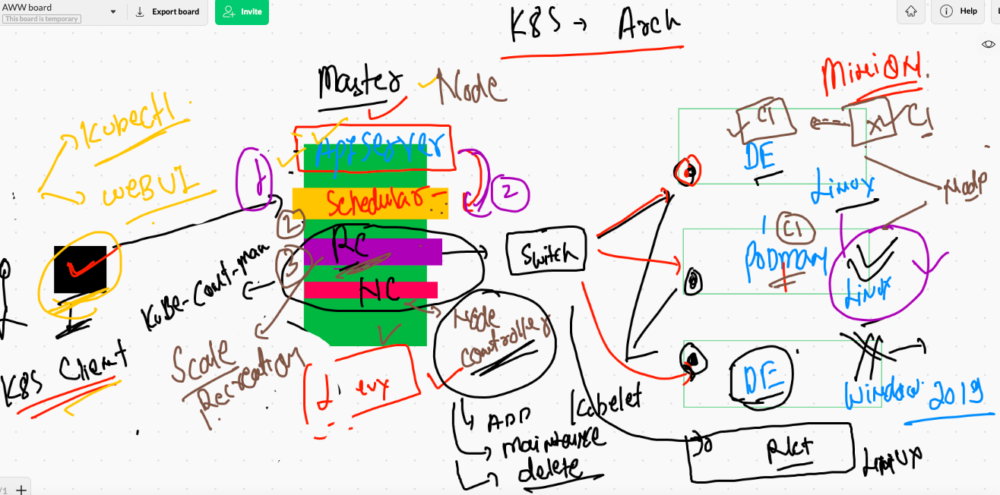

### ETCD 

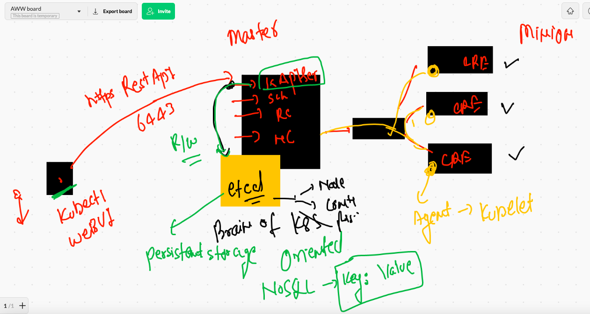

## Container NEtworking. by CNI in K8s 

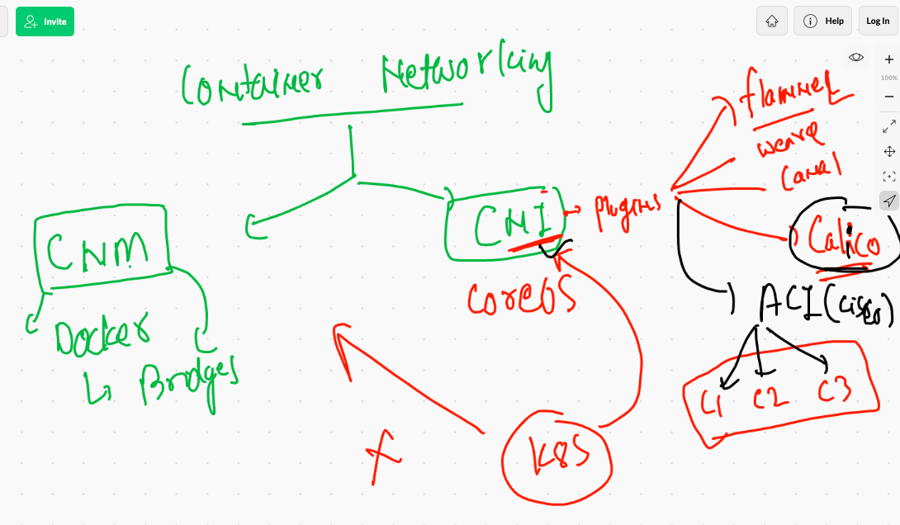

### Minion Side CNI bridge for container networking 

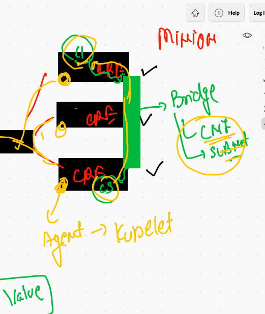

### Minion Side container communication -- 


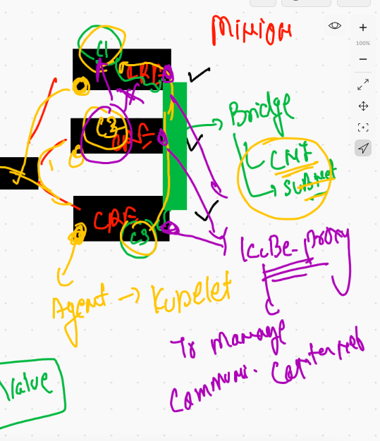

## K8s  cluster Deployment 

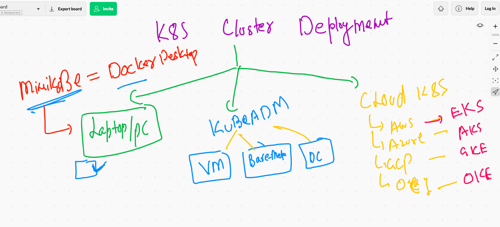

## Intro TO Minikube 

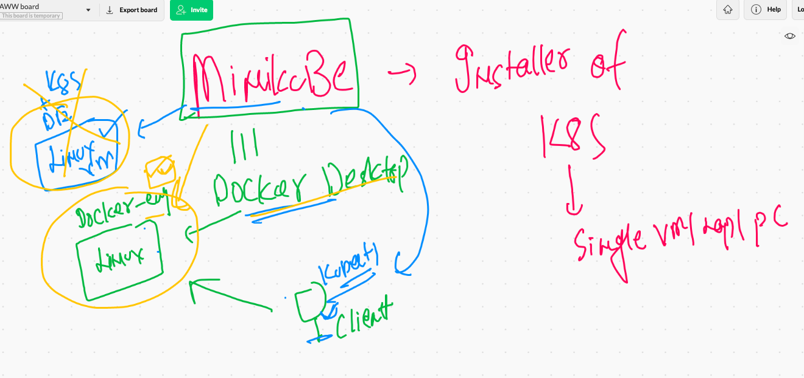

## Minikube installation on mac 

```
❯ curl -LO https://storage.googleapis.com/minikube/releases/latest/minikube-darwin-amd64
  % Total    % Received % Xferd  Average Speed   Time    Time     Time  Current
                                 Dload  Upload   Total   Spent    Left  Speed
100 60.3M  100 60.3M    0     0  3905k      0  0:00:15  0:00:15 --:--:-- 3828k
❯ sudo install minikube-darwin-amd64 /usr/local/bin/minikube
Password:
Sorry, try again.
Password:
Sorry, try again.
Password:

---

❯ minikube  version
minikube version: v1.20.0
commit: c61663e942ec43b20e8e70839dcca52e44cd85ae

```

### switching to default docker context 

```
❯ docker  context  use  default

```

### setting up cluser

```
❯ minikube start  --driver=docker
😄  minikube v1.20.0 on Darwin 11.4
✨  Using the docker driver based on existing profile
👍  Starting control plane node minikube in cluster minikube
🚜  Pulling base image ...
🔄  Restarting existing docker container for "minikube" ...
🐳  Preparing Kubernetes v1.20.2 on Docker 20.10.6 ...
🔎  Verifying Kubernetes components...
    ▪ Using image gcr.io/k8s-minikube/storage-provisioner:v5
🌟  Enabled addons: default-storageclass
🏄  Done! kubectl is now configured to use "minikube" cluster and "default" namespace by default


```

### checking minikube cluster 

```
 minikube  status
minikube
type: Control Plane
host: Running
kubelet: Running
apiserver: Running
kubeconfig: Configured

```

### Minikube the single node Cluster 

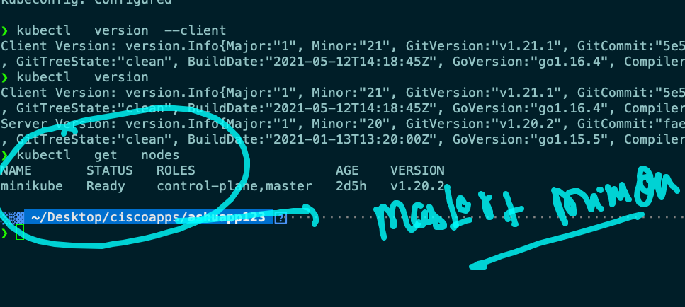

##

```
❯ kubectl  cluster-info
Kubernetes control plane is running at https://127.0.0.1:63145
KubeDNS is running at https://127.0.0.1:63145/api/v1/namespaces/kube-system/services/kube-dns:dns/proxy

To further debug and diagnose cluster problems, use 'kubectl cluster-info dump'.


```

## Creating multiple context

### method 1 

### stop minikube cluster 

```
❯ minikube  stop
✋  Stopping node "minikube"  ...
🛑  Powering off "minikube" via SSH ...
🛑  1 nodes stopped.

```

## ON Kubeadm cluster 

### checking auth token file on master node

```
[root@ip-172-31-82-89 ~]# cd  /etc/kubernetes/
[root@ip-172-31-82-89 kubernetes]# ls
admin.conf 

```

## connecting external k8s cluster 

```
 kubectl   get   nodes   --kubeconfig  admin.conf
NAME                           STATUS   ROLES                  AGE     VERSION
ip-172-31-82-89.ec2.internal   Ready    control-plane,master   3h44m   v1.21.1
ip-172-31-85-18.ec2.internal   Ready    <none>                 3h42m   v1.21.1
ip-172-31-86-48.ec2.internal   Ready    <none>                 3h43m   v1.21.1
ip-172-31-89-48.ec2.internal   Ready    <none>                 3h42m   v1.21.1


```


###  Creating context with minikube 

```
❯ minikube  start
😄  minikube v1.20.0 on Darwin 11.4
✨  Using the docker driver based on existing profile
👍  Starting control plane node minikube in cluster minikube
🚜  Pulling base image ...
🔄  Restarting existing docker container for "minikube" ...
🐳  Preparing Kubernetes v1.20.2 on Docker 20.10.6 ...
🔎  Verifying Kubernetes components...
    ▪ Using image gcr.io/k8s-minikube/storage-provisioner:v5
🌟  Enabled addons: storage-provisioner, default-storageclass
🏄  Done! kubectl is now configured to use "minikube" cluster and "default" namespace by default
❯ kubectl   get  nodes
NAME       STATUS   ROLES                  AGE    VERSION
minikube   Ready    control-plane,master   2d5h   v1.20.2
❯ kubectl   config  get-contexts
CURRENT   NAME                          CLUSTER      AUTHINFO           NAMESPACE
          kubernetes-admin@kubernetes   kubernetes   kubernetes-admin   
*         minikube                      minikube     minikube           default


```


