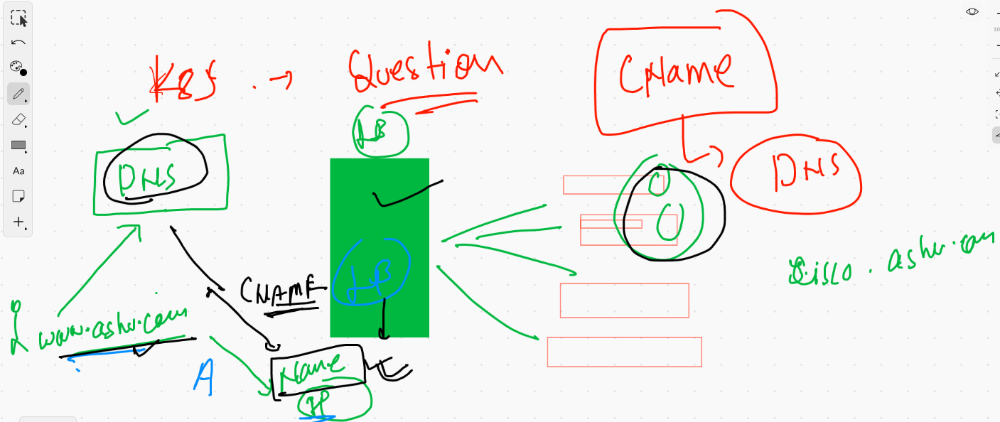
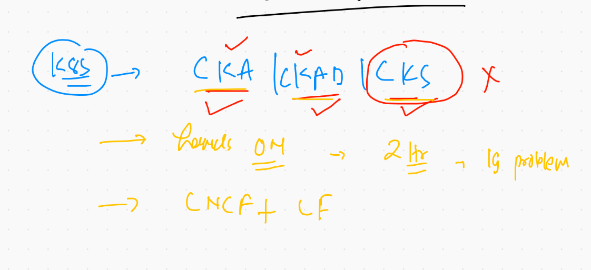
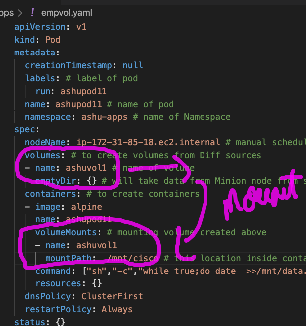

## Cname COncept in DNS with K8s 



## k8s certification tracks 



# k8s storage concept 


[volumes](https://kubernetes.io/docs/concepts/storage/volumes/)


## Creating and mounting volumes 



### emptyDIr example 

```
❯ kubectl  apply -f  empvol.yaml --dry-run=client
pod/ashupod11 created (dry run)
❯ kubectl  apply -f  empvol.yaml
pod/ashupod11 created
❯ kubectl  get  po
NAME        READY   STATUS    RESTARTS   AGE
ashupod11   1/1     Running   0  

```

### Describe POd 

```
❯ kubectl  describe  pod ashupod11
Name:         ashupod11
Namespace:    ashu-apps
Priority:     0
Node:         ip-172-31-85-18.ec2.internal/172.31.85.18
Start Time:   Fri, 11 Jun 2021 11:18:35 +0530
Labels:       run=ashupod11
Annotations:  cni.projectcalico.org/podIP: 192.168.10.172/32
              cni.projectcalico.org/podIPs: 192.168.10.172/32
Status:       Running
IP:           192.168.10.172
IPs:
  IP:  192.168.10.172
Containers:
  ashupod11:
    Container ID:  docker://453bfb5129a010accd0e491470e3e36706c1e5433c1793da1976158f2b4dda72
    Image:         alpine
    Image ID:      docker-pullable://alpine@sha256:69e70a79f2d41ab5d637de98c1e0b055206ba40a8145e7bddb55ccc04e13cf8f
    Port:          <none>
    Host Port:     <none>
    Command:
      sh
      -c
      while true;do date  >>/mnt/cisco/data.txt;sleep 5;done
    State:          Running


```

### Data writing in Node 

```
❯ kubectl  exec -it  ashupod11  -- sh
/ # cd  /mnt/cisco/
/mnt/cisco # ls
data.txt
/mnt/cisco # wc -l data.txt 
150 data.txt
/mnt/cisco # wc -l data.txt 
151 data.txt
/mnt/cisco # wc -l data.txt 
151 data.txt
/mnt/cisco # wc -l data.txt 
152 data.txt
/mnt/cisco # wc -l data.txt 
152 data.txt
/mnt/cisco # wc -l data.txt 
152 data.txt
/mnt/cisco # wc -l data.txt 
153 data.txt
/mnt/cisco # exit


```

### Multi container POD 


