# Introduction to Namespace and Cgroups 


## Switching context. 

```
❯ docker  context  ls
NAME                TYPE                DESCRIPTION                               DOCKER ENDPOINT               KUBERNETES ENDPOINT                 ORCHESTRATOR
awsDE               moby                                                          ssh://cisco@54.156.100.112                                        
default *           moby                Current DOCKER_HOST based configuration   unix:///var/run/docker.sock   https://127.0.0.1:57644 (default)   swarm
❯ docker  context  use  awsDE
awsDE
❯ docker  context  ls
NAME                TYPE                DESCRIPTION                               DOCKER ENDPOINT               KUBERNETES ENDPOINT                 ORCHESTRATOR
awsDE *             moby                                                          ssh://cisco@54.156.100.112                                        
default             moby                Current DOCKER_HOST based configuration   unix:///var/run/docker.sock   https://127.0.0.1:57644 (default)   swarm

```

## Namespace the backbone of container creation process 

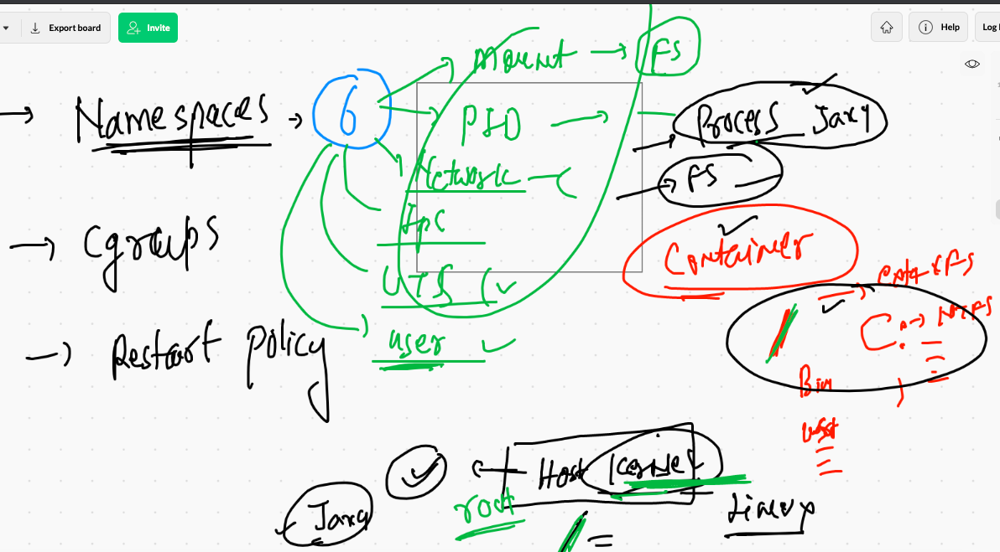

## Cgroups in container 

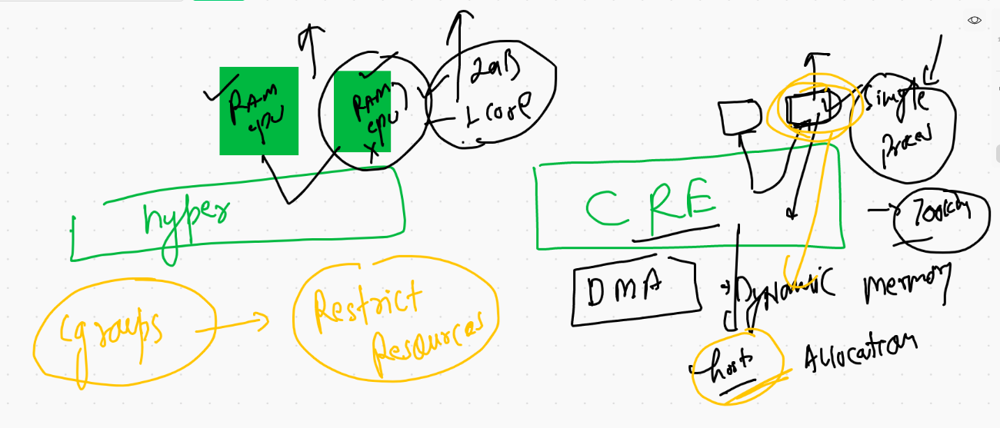

```
❯ docker  run  -itd --name  ashuc2  --memory 100M   busybox  ping fb.com
Unable to find image 'busybox:latest' locally
latest: Pulling from library/busybox
b71f96345d44: Pull complete 
Digest: sha256:930490f97e5b921535c153e0e7110d251134cc4b72bbb8133c6a5065cc68580d
Status: Downloaded newer image for busybox:latest
90e815db6f6493ed87438d48181bec76ca1efab0552d458f0734e7d14cfc9e4e
❯ docker  ps
CONTAINER ID   IMAGE            COMMAND                CREATED          STATUS          PORTS                  NAMES
90e815db6f64   busybox          "ping fb.com"          5 seconds ago    Up 3 seconds                           ashuc2
3c93475e5f39   alpine           "ping 127.0.0.1"       3 minutes ago    Up 3 minutes                           ashuc123
d04209cc5c93   varunhttp:v002   "httpd -DFOREGROUND"   56 minutes ago   Up 56 minutes   0.0.0.0:8501->80/tcp   varunwebC2


```

### checking resources

```
docker stats 

CONTAINER ID   NAME         CPU %     MEM USAGE / LIMIT    MEM %     NET I/O           BLOCK I/O     PIDS
90e815db6f64   ashuc2       0.01%     640KiB / 100MiB      0.62%     12.5kB / 11.6kB   0B / 0B       1
3c93475e5f39   ashuc123     0.01%     1.523MiB / 7.69GiB   0.02%     978B / 0B         1.24MB / 0B   1
d04209cc5c93   varunwebC2   0.11%     19.87MiB / 7.69GiB   0.25%     1.63kB / 0B       15MB / 0B     213
^C%                 

```

## Restart policy 

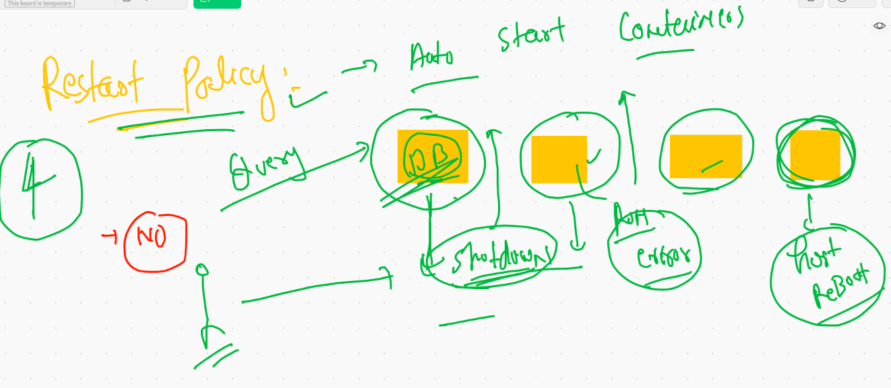

## checking restart policy 

```
 docker  inspect  varunwebC2   --format='{{.HostConfig.RestartPolicy.Name}}'    

```

### name of restart policies 

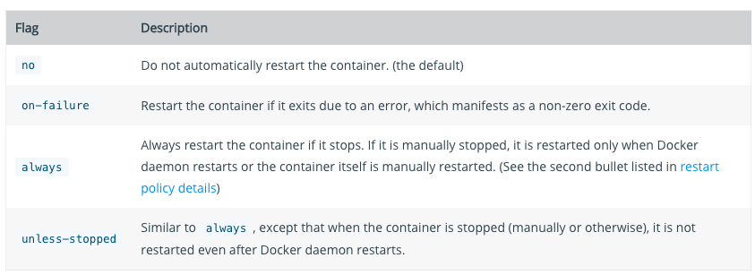

## setting restart policy to a container 

```
❯ docker  run -itd --name helloc1  --restart  always  busybox ping localhost
82e7eae217034ec3c9f4c9011f74e56a0687c5f6080fb6044a486f6e73e709e1
❯ docker  inspect  helloc1   --format='{{.HostConfig.RestartPolicy.Name}}'
always

```

## Java code based Dockerifle 

```
❯ ls
hello.java      java.dockerfile
❯ docker  build  -t  ashujava:ciscov1  .
unable to prepare context: unable to evaluate symlinks in Dockerfile path: lstat /Users/fire/Desktop/ciscoapps/java/Dockerfile: no such file or directory
❯ docker  build  -t  ashujava:ciscov1   -f java.dockerfile   .
Sending build context to Docker daemon  3.584kB
Step 1/7 : FROM openjdk
latest: Pulling from library/openjdk
5a581c13a8b9: Extracting  22.58MB/42.18MB
26cd02acd9c2: Download complete 
66727af51578: Download complete 


```


## Dockerfile with JDK install and use 

```
❯ ls
hello.java            installjdk.dockerfile java.dockerfile
❯ docker build -t  new:jdk8 -f  installjdk.dockerfile  .
Sending build context to Docker daemon  4.608kB
Step 1/8 : FROM oraclelinux:8.3
 ---> 816d99f0bbe8
Step 2/8 : MAINTAINER ashutoshh
 ---> Running in 6cd264e021a2
Removing intermediate container 6cd264e021a2
 ---> bf55fec68e85
Step 3/8 : RUN dnf install java-1.8.0-openjdk.x86_64 -y
 ---> Running in ebf6fb6b8640
Oracle Linux 8 BaseOS Latest (x86_64)           152 MB/s |  35 MB     00:00    
Oracle Linux 8 Application Stream (x86_64)      138 MB/s |  28 MB     00:00    
Last metadata expiration check: 0:00:06 ago on Tue Jun  8 07:10:55 2021.
Dependencies resolved.
================================================================================================
 Package                       Arch    Version                          Repository          Size
================================================================================================
Installing:
 java-1.8.0-openjdk            x86_64  1:1.8.0.292.b10-1.el8_4          ol8_appstream      335 k
Installing dependencies:
 aajohan-comfortaa-fonts       noarch  3.001-2.el8                      ol8_baseos_latest  148 k
 
 
 ```
 
 ### Creating container of java normal code
 
 ```
 docker  run -itd --name ashujc1 --restart  always --memory=300M --cpu-shares=20 6e6f2fb28805 
10069  docker  stats
10070  docker  logs  -f  ashujc1

```
# Docker networking 

## Network topology 

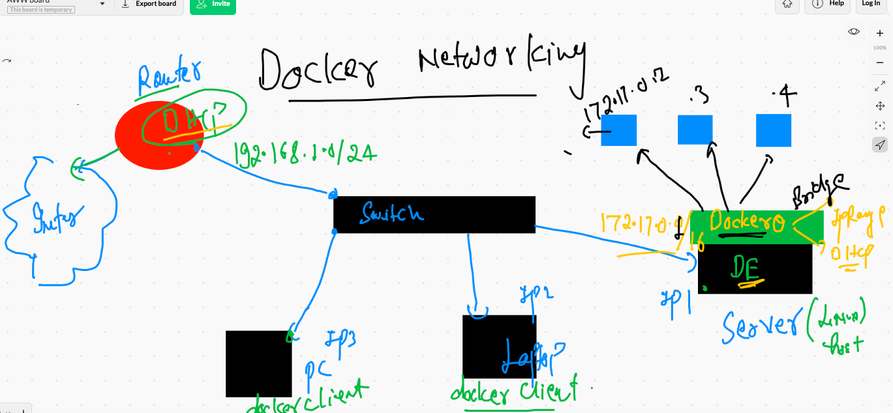

### creating container with docker bridge ip 

```
❯ docker  run  -tid --name ashuc1  alpine  ping localhost
9d73d2c2803d2799a2ee41d19b96b623663f6a2ca26a17c68b563fce6c0f7a01
❯ docker  ps
CONTAINER ID   IMAGE     COMMAND            CREATED         STATUS         PORTS     NAMES
9d73d2c2803d   alpine    "ping localhost"   5 seconds ago   Up 3 seconds             ashuc1
❯ docker  exec  -it  ashuc1  sh
/ # ifconfig 
eth0      Link encap:Ethernet  HWaddr 02:42:AC:11:00:02  
          inet addr:172.17.0.2  Bcast:172.17.255.255  Mask:255.255.0.0
          UP BROADCAST RUNNING MULTICAST  MTU:1500  Metric:1
          RX packets:10 errors:0 dropped:0 overruns:0 frame:0
          TX packets:0 errors:0 dropped:0 overruns:0 carrier:0
          collisions:0 txqueuelen:0 
          RX bytes:836 (836.0 B)  TX bytes:0 (0.0 B)

lo        Link encap:Local Loopback  
          inet addr:127.0.0.1  Mask:255.0.0.0
          UP LOOPBACK RUNNING  MTU:65536  Metric:1
          RX packets:46 errors:0 dropped:0 overruns:0 frame:0
          TX packets:46 errors:0 dropped:0 overruns:0 carrier:0
          collisions:0 txqueuelen:1000 
          RX bytes:3864 (3.7 KiB)  TX bytes:3864 (3.7 KiB)


```

### best way to check IP address of a container 

```
❯ docker  inspect  netcon1   --format='{{.NetworkSettings.IPAddress}}'
172.17.0.3
❯ docker  inspect  ashuc1   --format='{{.NetworkSettings.IPAddress}}'
172.17.0.2
❯ docker  inspect  manishax1  --format='{{.NetworkSettings.IPAddress}}'
172.17.0.4

```

## NAT concept is already there if ANy container wants to connect outside host 

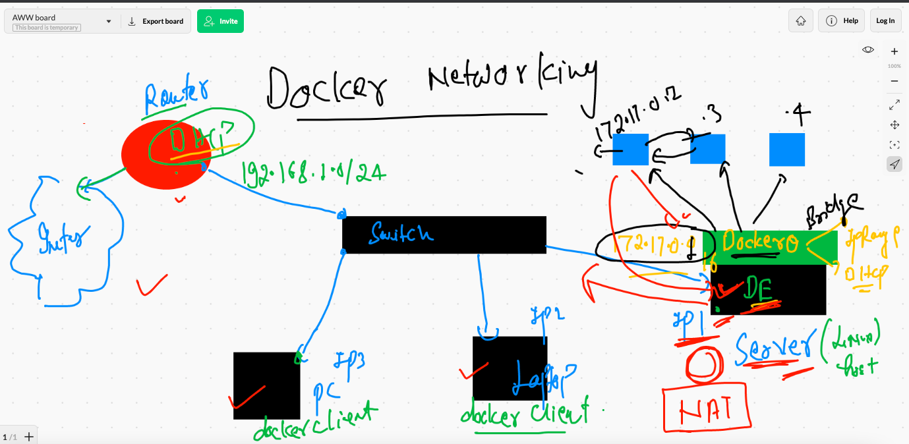

## POrt forwarding rule 

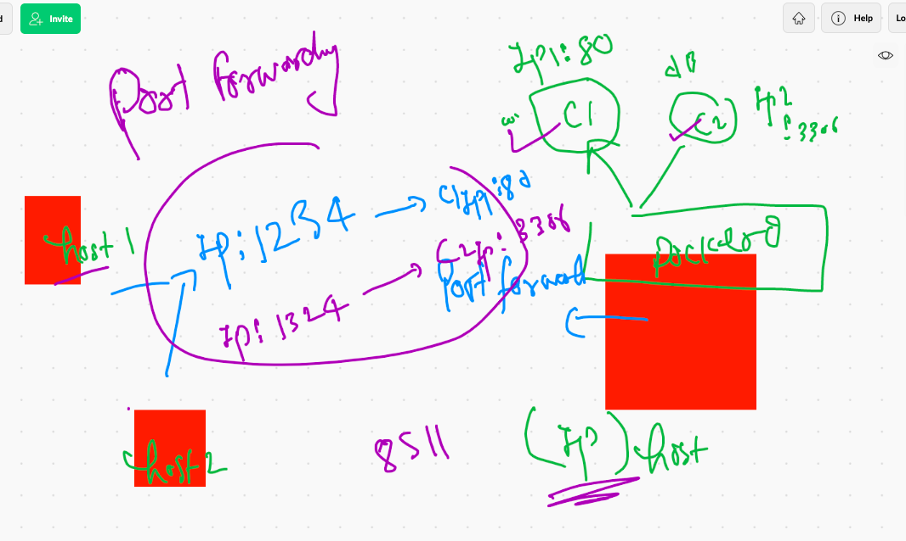

## docker0 Bridge is never preffered 

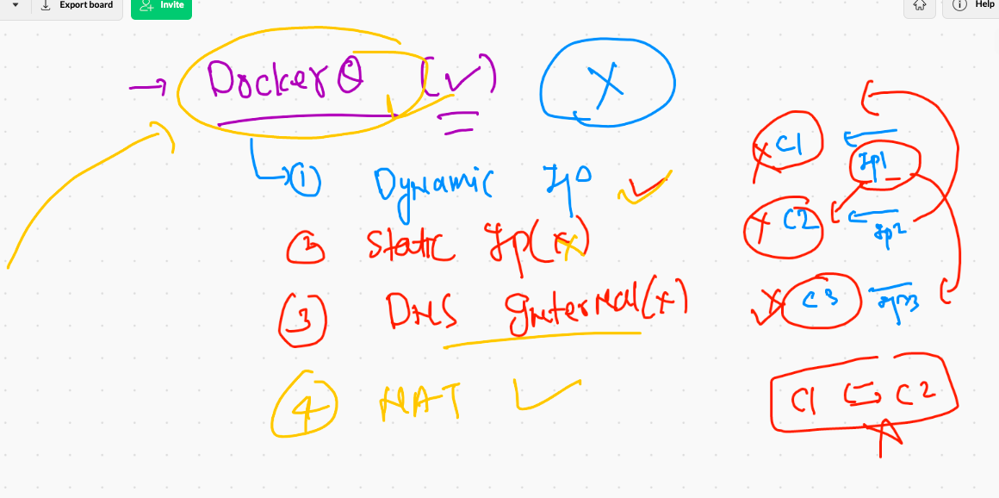

## TIme to use custom bridge 

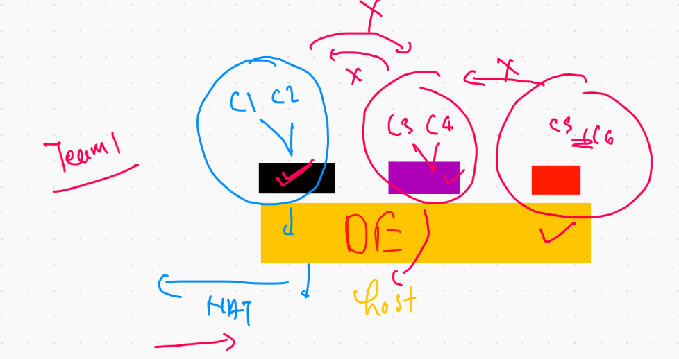

## default docker bridges

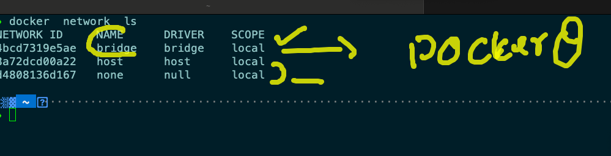

### Detailed infor about Docker0 bridge 

```
❯ docker  network  inspect  bridge
[
    {
        "Name": "bridge",
        "Id": "4bcd7319e5ae51c503a51f115e78a8025320b9e93442afda62f214ae1bab8dbb",
        "Created": "2021-06-08T05:59:26.985047106Z",
        "Scope": "local",
        "Driver": "bridge",
        "EnableIPv6": false,
        "IPAM": {
            "Driver": "default",
            "Options": null,
            "Config": [
                {
                    "Subnet": "172.17.0.0/16",
                    "Gateway": "172.17.0.1"
                }
            ]
        },
        "Internal": false,
        "Attachable": false,
        "Ingress": false,
        "ConfigFrom": {
            "Network": ""
        },
        "ConfigOnly": false,
        "Containers": {
            "081a8eb54ff679e7e7b938973759249ade1bb37eec6b1aea68fc38481ed3567a": {
                "Name": "netcon1",
                "EndpointID": "b34d090895e42a9f396834f29313259eb9c5c43c7b117df7792f9724d5a08306",
                "MacAddress": "02:42:ac:11:00:03",
                "IPv4Address": "172.17.0.3/16",
                "IPv6Address": ""


```

### Container without any networking 

```
❯ docker run -it --rm  --network  none  busybox sh
/ # 
/ # 
/ # ifconfig 
lo        Link encap:Local Loopback  
          inet addr:127.0.0.1  Mask:255.0.0.0
          UP LOOPBACK RUNNING  MTU:65536  Metric:1
          RX packets:0 errors:0 dropped:0 overruns:0 frame:0
          TX packets:0 errors:0 dropped:0 overruns:0 carrier:0
          collisions:0 txqueuelen:1000 
          RX bytes:0 (0.0 B)  TX bytes:0 (0.0 B)

/ # ping 172.17.0.2
PING 172.17.0.2 (172.17.0.2): 56 data bytes
ping: sendto: Network is unreachable
/ # ping google.com 
ping: bad address 'google.com'
/ # exit
❯ 

```


### Container with Host Address 

```
❯ docker run -it --rm  --network  host   busybox sh
/ # ifconfig 
docker0   Link encap:Ethernet  HWaddr 02:42:11:20:B0:EE  
          inet addr:172.17.0.1  Bcast:172.17.255.255  Mask:255.255.0.0
          inet6 addr: fe80::42:11ff:fe20:b0ee/64 Scope:Link
          UP BROADCAST MULTICAST  MTU:1500  Metric:1
          RX packets:56955 errors:0 dropped:0 overruns:0 frame:0
          TX packets:60608 errors:0 dropped:0 overruns:0 carrier:0
          collisions:0 txqueuelen:0 
          RX bytes:4396503 (4.1 MiB)  TX bytes:181527421 (173.1 MiB)

eth0      Link encap:Ethernet  HWaddr 0A:8A:E5:C1:E3:A3  
          inet addr:172.31.27.216  Bcast:172.31.31.255  Mask:255.255.240.0
          inet6 addr: fe80::88a:e5ff:fec1:e3a3/64 Scope:Link
          UP BROADCAST RUNNING MULTICAST  MTU:9001  Metric:1
          RX packets:615435 errors:0 dropped:0 overruns:0 frame:0
          TX packets:159858 errors:0 dropped:0 overruns:0 carrier:0
          collisions:0 txqueuelen:1000 
          RX bytes:748548363 (713.8 MiB)  TX bytes:82032381 (78.2 MiB)


```

## creating custom bridge 

```
❯ docker  network  create   ashubr1
e68c23e24cc35d9bdd9cf65401896fdf0e9df1c3f019e725105bb6e9c0a30eb8
❯ docker network  ls
NETWORK ID     NAME      DRIVER    SCOPE
e68c23e24cc3   ashubr1   bridge    local
4bcd7319e5ae   bridge    bridge    local
8a72dcd00a22   host      host      local
d4808136d167   none      null      local

```

### Details about bridge 

```
❯ docker network  inspect  ashubr1
[
    {
        "Name": "ashubr1",
        "Id": "e68c23e24cc35d9bdd9cf65401896fdf0e9df1c3f019e725105bb6e9c0a30eb8",
        "Created": "2021-06-08T09:21:28.892331464Z",
        "Scope": "local",
        "Driver": "bridge",
        "EnableIPv6": false,
        "IPAM": {
            "Driver": "default",
            "Options": {},
            "Config": [
                {
                    "Subnet": "172.18.0.0/16",
                    "Gateway": "172.18.0.1"
                }
            ]
        },


```

### create bridge with custom subnet 

```
❯ docker  network  create   ashubr2  --subnet 192.168.20.0/24
99b78dcc8af078596f957d0029807ff503bf61858fbc94517e6808e066e783aa
❯ docker network  ls
NETWORK ID     NAME            DRIVER    SCOPE
e68c23e24cc3   ashubr1         bridge    local
99b78dcc8af0   ashubr2         bridge    local

```

### creating containers 

```

10123  docker  network  create   ashubr2  --subnet 192.168.20.0/24    
10124  docker network  ls
10125  history
10126  docker network  ls
10127  docker  run -itd --name ashuc1  --network ashubr1   alpine ping 127.0.0.1 
10128  docker  run -itd --name ashuc2  --network ashubr1   alpine ping 127.0.0.1 
10129  docker  run -itd --name ashuc3  --network ashubr2   alpine ping 127.0.0.1 
10130  docker  run -itd --name ashuc4  --network ashubr2 --ip 192.168.20.100  alpine ping 127.0.0.1 

```

### Docker network drivers 

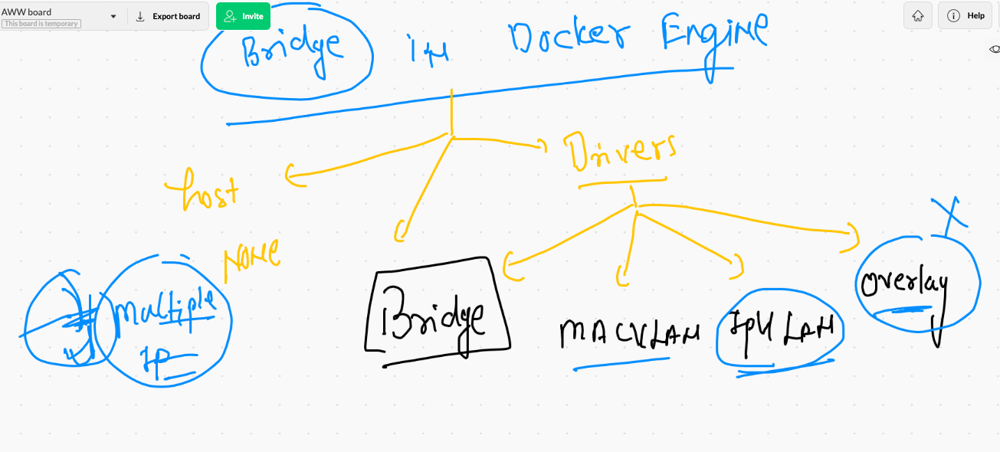

### Overlay driver 

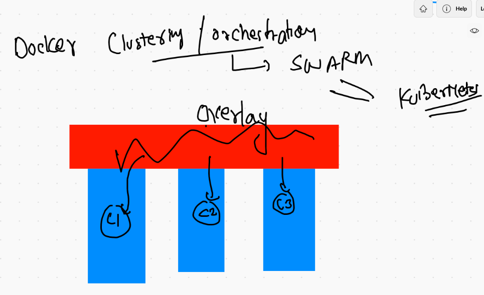


### Removing all docker network 

```
❯ docker  network  prune
WARNING! This will remove all custom networks not used by at least one container.
Are you sure you want to continue? [y/N] y
Deleted Networks:
khalidbr1
varun1
vishnu_bridge
ashubr2
manishBr2
manishBr1
ashubr1
derpaul
derpaul-192-168-131-0
sushil_bridge
vishnu_bridge1
khalidbr2
varun2

❯ docker  network  ls
NETWORK ID     NAME      DRIVER    SCOPE
4bcd7319e5ae   bridge    bridge    local
8a72dcd00a22   host      host      local
d4808136d167   none      null      local

```

## Docker storage concept 

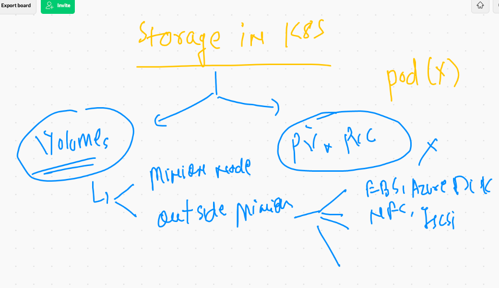

### attaching and preparing storage for Docker Engine 

```
[root@ip-172-31-27-216 ~]# lsblk 
NAME          MAJ:MIN RM  SIZE RO TYPE MOUNTPOINT
nvme0n1       259:0    0  100G  0 disk 
|-nvme0n1p1   259:1    0  100G  0 part /
`-nvme0n1p128 259:2    0    1M  0 part 
nvme1n1       259:3    0   50G  0 disk 
[root@ip-172-31-27-216 ~]# mkfs.xfs   /dev/nvme1n1 
meta-data=/dev/nvme1n1           isize=512    agcount=4, agsize=3276800 blks
         =                       sectsz=512   attr=2, projid32bit=1
         =                       crc=1        finobt=1, sparse=0
data     =                       bsize=4096   blocks=13107200, imaxpct=25
         =                       sunit=0      swidth=0 blks
naming   =version 2              bsize=4096   ascii-ci=0 ftype=1
log      =internal log           bsize=4096   blocks=6400, version=2
         =                       sectsz=512   sunit=0 blks, lazy-count=1
realtime =none                   extsz=4096   blocks=0, rtextents=0
[root@ip-172-31-27-216 ~]# mkdir  /mnt/cisco
[root@ip-172-31-27-216 ~]# 
[root@ip-172-31-27-216 ~]# 
[root@ip-172-31-27-216 ~]# mount  /dev/nvme1n1   /mnt/cisco/
[root@ip-172-31-27-216 ~]# 
[root@ip-172-31-27-216 ~]# vim  /etc/fstab 
[root@ip-172-31-27-216 ~]# cat /etc/fstab 
#
UUID=7b355c6b-f82b-4810-94b9-4f3af651f629     /           xfs    defaults,noatime  1   1
/dev/nvme1n1   /mnt/cisco/    xfs  defaults  0 0 

```

### if you have storage mounted then as Docker engineer 

```
[root@ip-172-31-27-216 ~]# cd  /etc/sysconfig/
[root@ip-172-31-27-216 sysconfig]# ls
acpid       clock     docker          init        modules          nfs            rpc-rquotad  run-parts  sysstat.ioconf
atd         console   docker-storage  irqbalance  netconsole       raid-check     rpcbind      selinux
authconfig  cpupower  grub            keyboard    network          rdisc          rsyncd       sshd
chronyd     crond     i18n            man-db      network-scripts  readonly-root  rsyslog      sysstat
[root@ip-172-31-27-216 sysconfig]# vim  docker
[root@ip-172-31-27-216 sysconfig]# cat  docker
# The max number of open files for the daemon itself, and all
# running containers.  The default value of 1048576 mirrors the value
# used by the systemd service unit.
DAEMON_MAXFILES=1048576

# Additional startup options for the Docker daemon, for example:
# OPTIONS="--ip-forward=true --iptables=true"
# By default we limit the number of open files per container
OPTIONS="--default-ulimit nofile=1024:4096   -g  /mnt/cisco/"

# How many seconds the sysvinit script waits for the pidfile to appear
# when starting the daemon.
DAEMON_PIDFILE_TIMEOUT=10
[root@ip-172-31-27-216 sysconfig]# systemctl daemon-reload 
[root@ip-172-31-27-216 sysconfig]# systemctl restart  docker 


```

### to sync data  from /var/lib/docker. -- /mnt/docker 

```
rsync -avp  /var/lib/docker/  /mnt/cisco/

```

## Container storage 

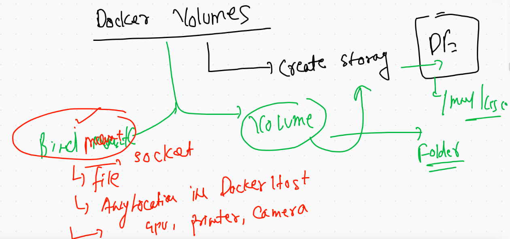


## creating volume 

```
❯ docker  volume  create  ashuvol1
ashuvol1
❯ docker  volume   ls
DRIVER    VOLUME NAME
local     ashuvol1


❯ docker  volume   inspect  ashuvol1
[
    {
        "CreatedAt": "2021-06-08T11:09:47Z",
        "Driver": "local",
        "Labels": {},
        "Mountpoint": "/mnt/cisco/volumes/ashuvol1/_data",
        "Name": "ashuvol1",
        "Options": {},
        "Scope": "local"
    }
]


```


### creating a container 

```
❯ docker run -itd --name ashuc1 -v  ashuvol1:/mydata:rw    alpine
c7cdc3ac4fc414c758d74d8a871af789ae93d059525c8fc4e08a108b61adb081
❯ docker  ps
CONTAINER ID   IMAGE     COMMAND     CREATED         STATUS         PORTS     NAMES
c7cdc3ac4fc4   alpine    "/bin/sh"   7 seconds ago   Up 4 seconds             ashuc1

```

### create data 

```
❯ docker run -itd --name ashuc1 -v  ashuvol1:/mydata:rw    alpine
c7cdc3ac4fc414c758d74d8a871af789ae93d059525c8fc4e08a108b61adb081
❯ docker  ps
CONTAINER ID   IMAGE     COMMAND     CREATED         STATUS         PORTS     NAMES
c7cdc3ac4fc4   alpine    "/bin/sh"   7 seconds ago   Up 4 seconds             ashuc1
❯ docker  exec -it  ashuc1  sh
/ # ls
bin     etc     lib     mnt     opt     root    sbin    sys     usr
dev     home    media   mydata  proc    run     srv     tmp     var
/ # cd  /mydata/
/mydata # ls
/mydata # mkdir  hello world 
/mydata # echo  "Hey Guys "  >data.txt 
/mydata # ls
data.txt  hello     world
/mydata # 


```

### reading data from a different container 

```
❯ docker  run -it  --rm  -v ashuvol1:/okk:ro   centos bash
[root@5a891845118e /]# 
[root@5a891845118e /]# 
[root@5a891845118e /]# 
[root@5a891845118e /]# cd  /okk/
[root@5a891845118e okk]# ls
data.txt  hello  world
[root@5a891845118e okk]# 
[root@5a891845118e okk]# 
[root@5a891845118e okk]# rmdir world/
rmdir: failed to remove 'world/': Read-only file system
[root@5a891845118e okk]# ls
data.txt  hello  world
[root@5a891845118e okk]# exit
exit


```

### multiple volume for a single container 

```
❯ docker run -itd --name ashuc1 -v  ashuvol1:/mydata:rw  -v  ashuvol2:/hellocisco:ro   alpine
eb77b2d2616cbf68e8017a463f73953715ccc480f53ad7efad5ac22447f15e9f
❯ docker  volume  ls
DRIVER    VOLUME NAME
local     ashuvol1
local     ashuvol2

```

### POrtainer deploy as container 

```
docker  run  -tid --name webui --restart always  --memory 300M  -v  /var/run/docker.sock:/var/run/docker.sock  -p 8900:9000  portainer/portainer
```

### Data to container 

```
❯ docker  run  -itd --name  x33  -v   /etc:/myetc:ro   centos bash
f047e079258a00babd77fa8c7184ed84b6027acbe04ccac4419a5c5b97014605
❯ docker  exec -it  x33  bash
[root@f047e079258a /]# ls
bin  dev  etc  home  lib  lib64  lost+found  media  mnt  myetc	opt  proc  root  run  sbin  srv  sys  tmp  usr	var
[root@f047e079258a /]# cd  myetc/
[root@f047e079258a myetc]# ls
DIR_COLORS		 cron.d		    group-		 libnl		    os-release	      request-key.d  sudo-ldap.conf
DIR_COLORS.256color	 cron.daily	    grub.d		 libuser.conf	    pam.d	      resolv.conf    sudo.conf
DIR_COLORS.lightbgcolor  cron.deny	    grub2.cfg		 locale.conf	    passwd	      rpc	     sudoers
GREP_COLORS		 cron.hourly	    gshadow		 localtime	    passwd-	      rpm	     sudoers.d
GeoIP.conf		 cron.monthly	    gshadow-		 login.defs	    pip.conf	      rsyncd.conf    sysconfig
GeoIP.conf.default	 cron.weekly	    gss			 logrotate.conf     pkcs11	      rsyslog.conf   sysctl.conf
NetworkManager		 crontab	  

```

### mounting a file into a container 

```
docker  run  -it --name  x35  -v   /etc/passwd:/hello.txt:ro  centos bash  

```

## docker volume history 

```
10016  docker  volume  create  ashuvol1
10017  docker  volume   ls
10018  docker  volume   inspect  ashuvol1 
10019  docker  volume   ls
10020  docker run -itd --name ashuc1 -v  ashuvol1:/mydata:rw    alpine    
10021  docker  ps
10022  docker  exec -it  ashuc1  sh 
10023  docker  ps
10024  docker  rm  ashuc1  -f
10025  docker  volume  ls
10026  docker  run -it  --rm  -v ashuvol1:/okk:ro   centos bash 
10027  history
10028  docker run -itd --name ashuc1 -v  ashuvol1:/mydata:rw  -v  ashuvol2:/hellocisco:ro   alpine 
10029  docker  volume  ls
10030  history
10031* docker  context  ls
10032  docker  run  -tid --name webui --restart policy --memory 300M  -v  /var/run/docker.sock:/var/run/docker.sock  -p 8900:9000  portainer/portainer
10033  docker  run  -tid --name webui --restart always  --memory 300M  -v  /var/run/docker.sock:/var/run/docker.sock  -p 8900:9000  portainer/portainer
10034  docker  ps
10035  history
10036* docker  context  use default 
10037* docker  ps
10038* docker  rm  webui -f
10039* docker  context  use  awsDE
10040  docker  run  -itd --name  x33  -v   /etc:/myetc:ro   centos bash
10041  docker  exec -it  x33  bash 
10042  history
10043  docker  run  -itd --name  x34  -v   /etc:/hello.txt:ro  centos bash  
10044  docker  ps
10045  docker  run  -it --name  x35  -v   /etc/passwd:/hello.txt:ro  centos bash  

```

## MYsql DB with VOlume 

```
❯ docker  volume  create ashudbvol
ashudbvol
❯ docker  run -itd --name ashudbc1 -e  MYSQL_ROOT_PASSWORD

❯ docker  run -itd --name ashudbc1 -e  MYSQL_ROOT_PASSWORD=CiscoDb099  -v  ashudbvol:/var/lib/mysql   mysql
Unable to find image 'mysql:latest' locally
latest: Pulling from library/mysql
69692152171a: Already exists 
1651b0be3df3: Pull complete 
951da7386bc8: Pull complete 
0f86c95aa242: Pull complete 


```

## login into MYsqlDB container 

```
❯ docker  exec  -it   ashudbc1   bash
root@f92a509e865c:/# mysql -u root  -p
Enter password: 
Welcome to the MySQL monitor.  Commands end with ; or \g.
Your MySQL connection id is 8
Server version: 8.0.25 MySQL Community Server - GPL

Copyright (c) 2000, 2021, Oracle and/or its affiliates.

Oracle is a registered trademark of Oracle Corporation and/or its
affiliates. Other names may be trademarks of their respective
owners.

Type 'help;' or '\h' for help. Type '\c' to clear the current input statement.


```


