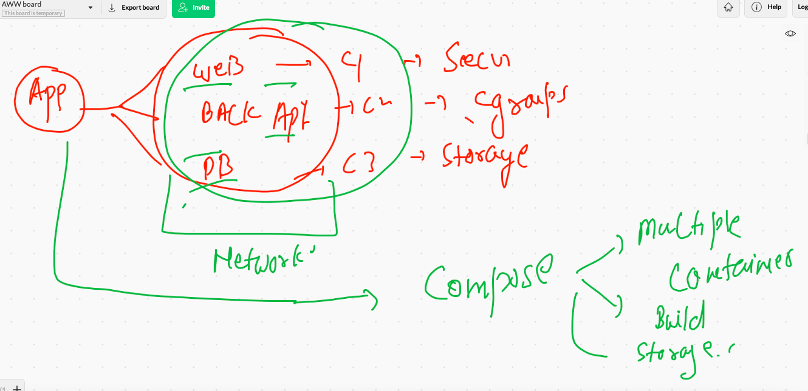
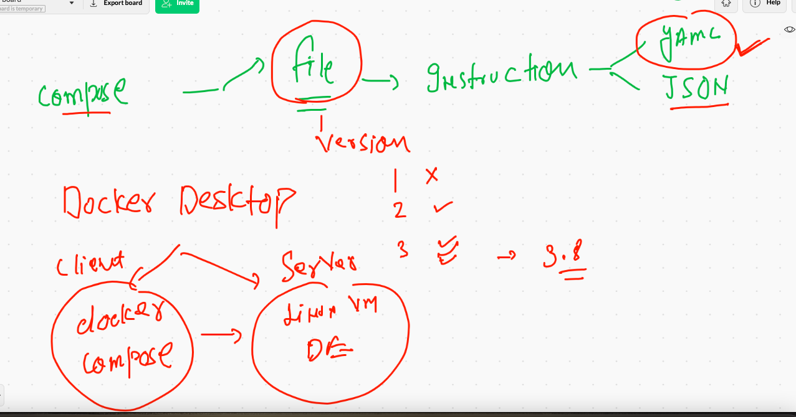
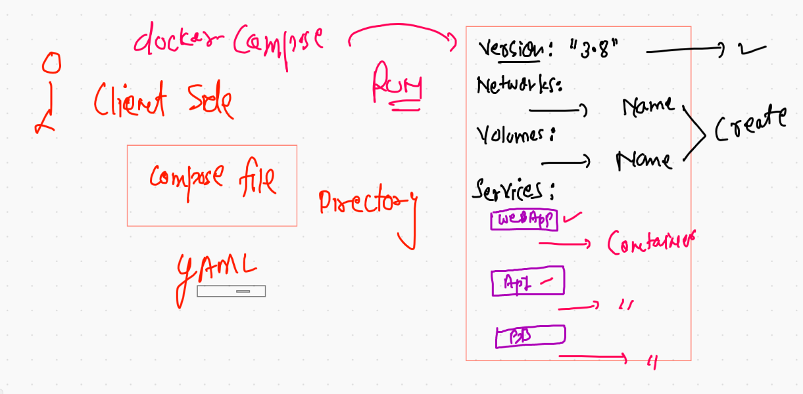

# Docker COmpose 

## Intro 



## Compose file version 




### link for version of file 

[version](https://docs.docker.com/compose/compose-file/)

## Compose version 

```
❯ docker-compose  -v
docker-compose version 1.29.1, build c34c88b2

```

### Docker compose file view 



### Example 1 

```
version: "3.8"
networks: # if you want to create your own bridge 
 ashubrx1122:  # name of Bridge to be created 
#volumes:
services:
    ashuapp1: # name of service
     image: alpine
     command: ping fb.com
     container_name: ashuc1  
     networks: # to use network created in above section 
        - ashubrx1122 # name of bridge 

```

### RUnning file 

```
docker-compose up -d

❯ docker-compose ps
 Name      Command     State   Ports
------------------------------------
ashuc1   ping fb.com   Up      

```

### compose commands are similar to docker 

```
❯ docker-compose  images
Container   Repository    Tag       Image Id       Size  
---------------------------------------------------------
ashuc1      alpine       latest   6dbb9cc54074   5.613 MB

docker-compose  logs 


===

❯ docker-compose stop
Stopping ashuc1 ... done
❯ docker-compose  ps
 Name      Command      State     Ports
---------------------------------------
ashuc1   ping fb.com   Exit 137   


===

❯ docker-compose  start
Starting ashuapp1 ... done
❯ docker-compose  ps
 Name      Command     State   Ports
------------------------------------
ashuc1   ping fb.com   Up         


```


### cleanup 

```
❯ docker-compose down
Stopping ashuc1 ... done
Removing ashuc1 ... done
Removing network ashuapp123_ashubrx1122

```


### history

```
10016* docker-compose up  -d
10017* docker-compose ps
10018  docker-compose ps 
10019  cd ashuapp123
10020  ls
10021  docker-compose ps
10022  docker-compose  images
10023  docker-compose  logs 
10024  history
10025  docker-compose stop 
10026  docker-compose  ps
10027  docker-compose  start
10028  docker-compose  ps
10029  ls
10030  mv  docker-compose.yaml  ashu.yml
10031  ls
10032  docker-compose ps
10033  docker-compose -f  ashu.yml ps 
10034  ls
10035  history
10036  docker-compose -f  ashu.yml ps 
10037  mv  ashu.yml docker-compose.yaml
10038  docker-compose ps 
10039  docker-compose down 

```

### Multiple service in compose 

```
version: "3.8"
volumes: # creating volume 
    ashudbvol: 
services:
    ashuapp1: # name of service
     image: alpine
     command: ping fb.com
     container_name: ashuc1  
    ashuapp2: # name of service 
     image: nginx
     container_name: ashuc2
     ports:
        - "1234:80"
    ashudbsvc1: # name of service
     image: mysql
     container_name: ashuc3
     environment:
        MYSQL_ROOT_PASSWORD: "CiscoDb099"
     volumes: # using volumes 
        - ashudbvol:/var/lib/mysql/
      

```

