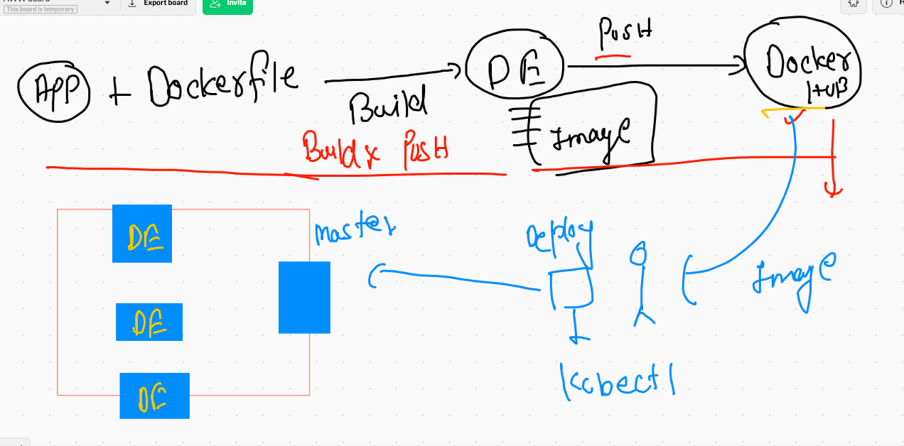
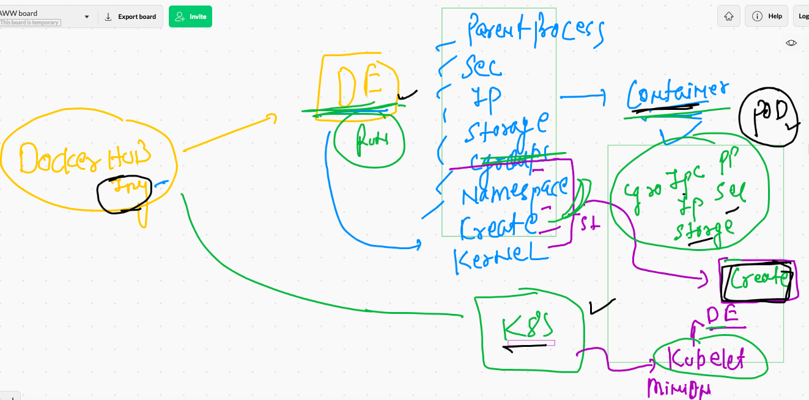
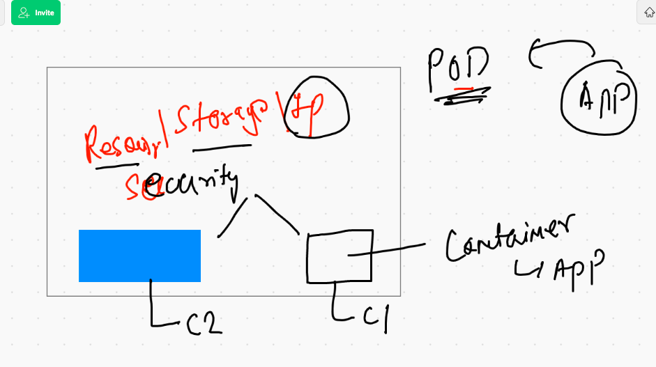
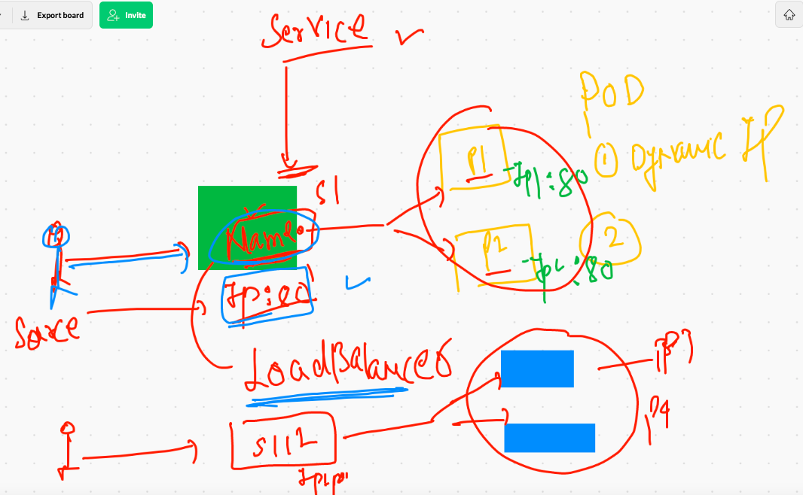
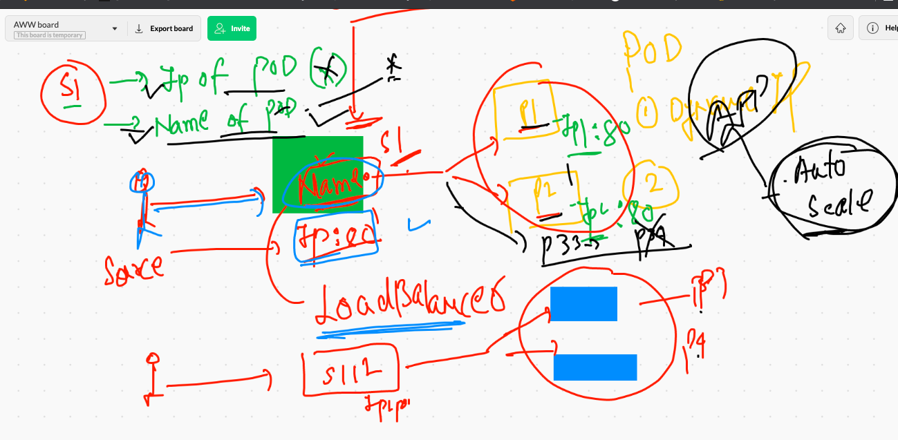
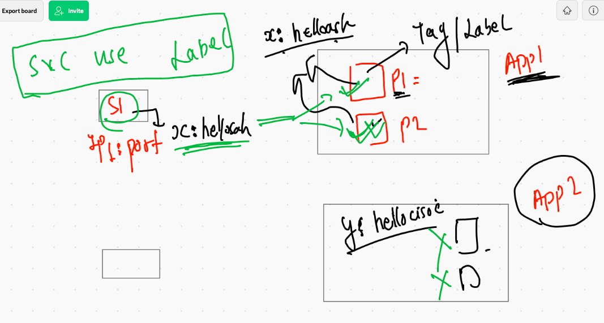
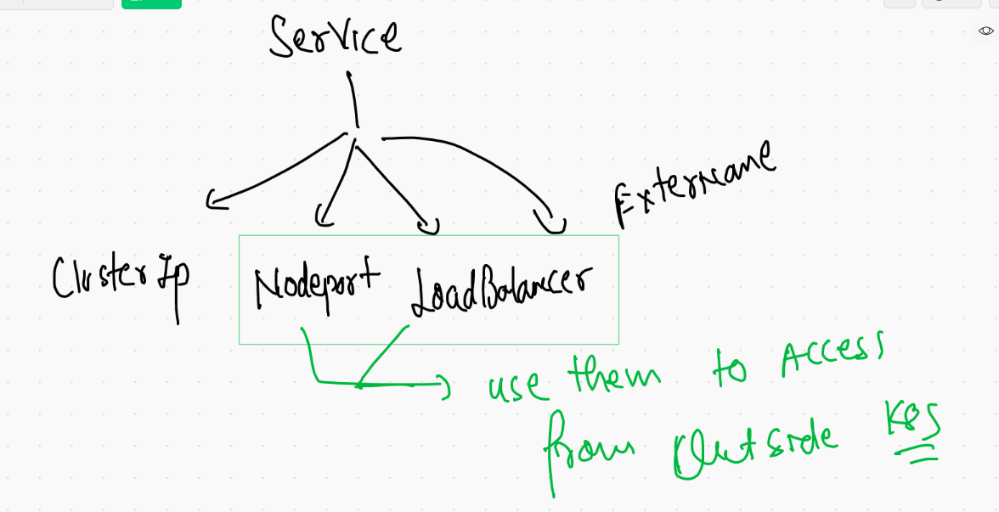

# Docker COmpose 

## Intro 


## Compose file version 


### link for version of file 

[version](https://docs.docker.com/compose/compose-file/)

## Compose version 

```
❯ docker-compose  -v
docker-compose version 1.29.1, build c34c88b2

```

### Docker compose file view 


### Example 1 

```
version: "3.8"
networks: # if you want to create your own bridge 
 ashubrx1122:  # name of Bridge to be created 
#volumes:
services:
    ashuapp1: # name of service
     image: alpine
     command: ping fb.com
     container_name: ashuc1  
     networks: # to use network created in above section 
        - ashubrx1122 # name of bridge 

```

### RUnning file 

```
docker-compose up -d

❯ docker-compose ps
 Name      Command     State   Ports
------------------------------------
ashuc1   ping fb.com   Up      

```

### compose commands are similar to docker 

```
❯ docker-compose  images
Container   Repository    Tag       Image Id       Size  
---------------------------------------------------------
ashuc1      alpine       latest   6dbb9cc54074   5.613 MB

docker-compose  logs 


===

❯ docker-compose stop
Stopping ashuc1 ... done
❯ docker-compose  ps
 Name      Command      State     Ports
---------------------------------------
ashuc1   ping fb.com   Exit 137   


===

❯ docker-compose  start
Starting ashuapp1 ... done
❯ docker-compose  ps
 Name      Command     State   Ports
------------------------------------
ashuc1   ping fb.com   Up         


```


### cleanup 

```
❯ docker-compose down
Stopping ashuc1 ... done
Removing ashuc1 ... done
Removing network ashuapp123_ashubrx1122

```


### history

```
10016* docker-compose up  -d
10017* docker-compose ps
10018  docker-compose ps 
10019  cd ashuapp123
10020  ls
10021  docker-compose ps
10022  docker-compose  images
10023  docker-compose  logs 
10024  history
10025  docker-compose stop 
10026  docker-compose  ps
10027  docker-compose  start
10028  docker-compose  ps
10029  ls
10030  mv  docker-compose.yaml  ashu.yml
10031  ls
10032  docker-compose ps
10033  docker-compose -f  ashu.yml ps 
10034  ls
10035  history
10036  docker-compose -f  ashu.yml ps 
10037  mv  ashu.yml docker-compose.yaml
10038  docker-compose ps 
10039  docker-compose down 

```

### Multiple service in compose 

```
version: "3.8"
volumes: # creating volume 
    ashudbvol: 
services:
    ashuapp1: # name of service
     image: alpine
     command: ping fb.com
     container_name: ashuc1  
    ashuapp2: # name of service 
     image: nginx
     container_name: ashuc2
     ports:
        - "1234:80"
    ashudbsvc1: # name of service
     image: mysql
     container_name: ashuc3
     environment:
        MYSQL_ROOT_PASSWORD: "CiscoDb099"
     volumes: # using volumes 
        - ashudbvol:/var/lib/mysql/
      

```


## Docker Engine is not a good fit to deploy production grade application issues 


## Container orchestration tools 


## K8s info 


## K8s architecuter 

### hardware 


## Master Node COmponents 

### KUbe-apiserver 


### KUbenetes client 


### kube-schedular 


### kube-controller-manager 


### Node controller 


### ETCD 


## Container NEtworking. by CNI in K8s 


### Minion Side CNI bridge for container networking 


### Minion Side container communication -- 


## K8s  cluster Deployment 


## Intro TO Minikube 


## Minikube installation on mac 

```
❯ curl -LO https://storage.googleapis.com/minikube/releases/latest/minikube-darwin-amd64
  % Total    % Received % Xferd  Average Speed   Time    Time     Time  Current
                                 Dload  Upload   Total   Spent    Left  Speed
100 60.3M  100 60.3M    0     0  3905k      0  0:00:15  0:00:15 --:--:-- 3828k
❯ sudo install minikube-darwin-amd64 /usr/local/bin/minikube
Password:
Sorry, try again.
Password:
Sorry, try again.
Password:

---

❯ minikube  version
minikube version: v1.20.0
commit: c61663e942ec43b20e8e70839dcca52e44cd85ae

```

### switching to default docker context 

```
❯ docker  context  use  default

```

### setting up cluser

```
❯ minikube start  --driver=docker
😄  minikube v1.20.0 on Darwin 11.4
✨  Using the docker driver based on existing profile
👍  Starting control plane node minikube in cluster minikube
🚜  Pulling base image ...
🔄  Restarting existing docker container for "minikube" ...
🐳  Preparing Kubernetes v1.20.2 on Docker 20.10.6 ...
🔎  Verifying Kubernetes components...
    ▪ Using image gcr.io/k8s-minikube/storage-provisioner:v5
🌟  Enabled addons: default-storageclass
🏄  Done! kubectl is now configured to use "minikube" cluster and "default" namespace by default


```

### checking minikube cluster 

```
 minikube  status
minikube
type: Control Plane
host: Running
kubelet: Running
apiserver: Running
kubeconfig: Configured

```

### Minikube the single node Cluster 


##

```
❯ kubectl  cluster-info
Kubernetes control plane is running at https://127.0.0.1:63145
KubeDNS is running at https://127.0.0.1:63145/api/v1/namespaces/kube-system/services/kube-dns:dns/proxy

To further debug and diagnose cluster problems, use 'kubectl cluster-info dump'.


```

## Creating multiple context

### method 1 

### stop minikube cluster 

```
❯ minikube  stop
✋  Stopping node "minikube"  ...
🛑  Powering off "minikube" via SSH ...
🛑  1 nodes stopped.

```

## ON Kubeadm cluster 

### checking auth token file on master node

```
[root@ip-172-31-82-89 ~]# cd  /etc/kubernetes/
[root@ip-172-31-82-89 kubernetes]# ls
admin.conf 

```

## connecting external k8s cluster 

```
 kubectl   get   nodes   --kubeconfig  admin.conf
NAME                           STATUS   ROLES                  AGE     VERSION
ip-172-31-82-89.ec2.internal   Ready    control-plane,master   3h44m   v1.21.1
ip-172-31-85-18.ec2.internal   Ready    <none>                 3h42m   v1.21.1
ip-172-31-86-48.ec2.internal   Ready    <none>                 3h43m   v1.21.1
ip-172-31-89-48.ec2.internal   Ready    <none>                 3h42m   v1.21.1


```


###  Creating context with minikube 

```
❯ minikube  start
😄  minikube v1.20.0 on Darwin 11.4
✨  Using the docker driver based on existing profile
👍  Starting control plane node minikube in cluster minikube
🚜  Pulling base image ...
🔄  Restarting existing docker container for "minikube" ...
🐳  Preparing Kubernetes v1.20.2 on Docker 20.10.6 ...
🔎  Verifying Kubernetes components...
    ▪ Using image gcr.io/k8s-minikube/storage-provisioner:v5
🌟  Enabled addons: storage-provisioner, default-storageclass
🏄  Done! kubectl is now configured to use "minikube" cluster and "default" namespace by default
❯ kubectl   get  nodes
NAME       STATUS   ROLES                  AGE    VERSION
minikube   Ready    control-plane,master   2d5h   v1.20.2
❯ kubectl   config  get-contexts
CURRENT   NAME                          CLUSTER      AUTHINFO           NAMESPACE
          kubernetes-admin@kubernetes   kubernetes   kubernetes-admin   
*         minikube                      minikube     minikube           default


```


## COntext in Kubernetes we can use to switch clusters 

### current list of contexts 

```
❯ kubectl  config  get-contexts
CURRENT   NAME                          CLUSTER      AUTHINFO           NAMESPACE
          kubernetes-admin@kubernetes   kubernetes   kubernetes-admin   
*         minikube                      minikube     minikube           default

```

### checking nodes 

```
❯ kubectl  get  nodes
NAME       STATUS   ROLES                  AGE    VERSION
minikube   Ready    control-plane,master   2d6h   v1.20.2

```

### switching contexts 

```
❯ kubectl  config  use-context   kubernetes-admin@kubernetes
Switched to context "kubernetes-admin@kubernetes".
❯ kubectl  config  get-contexts
CURRENT   NAME                          CLUSTER      AUTHINFO           NAMESPACE
*         kubernetes-admin@kubernetes   kubernetes   kubernetes-admin   
          minikube                      minikube     minikube           default
❯ kubectl  get  nodes
NAME                           STATUS   ROLES                  AGE     VERSION
ip-172-31-82-89.ec2.internal   Ready    control-plane,master   5h24m   v1.21.1
ip-172-31-85-18.ec2.internal   Ready    <none>                 5h23m   v1.21.1
ip-172-31-86-48.ec2.internal   Ready    <none>                 5h23m   v1.21.1
ip-172-31-89-48.ec2.internal   Ready    <none>                 5h23m   v1.21.1

```

## workflow to deploy any docker image in kubernetes cluster 



## Docker image to POD history 



### POD more details 



## Deploying first pod 

### checking syntax of yaml using dry-run 

```
❯ ls
ashupod1.yaml
❯ kubectl  apply -f  ashupod1.yaml  --dry-run=client
pod/ashupod-1 created (dry run)

```

### deploy POD 

```
❯ kubectl  apply -f  ashupod1.yaml
pod/ashupod-1 created
❯ kubectl  get  pods
NAME        READY   STATUS              RESTARTS   AGE
ashupod-1   0/1     ContainerCreating   0          9s

```

###  checking pod info in more detailed

```
❯ kubectl  get  nodes
NAME                           STATUS   ROLES                  AGE    VERSION
ip-172-31-82-89.ec2.internal   Ready    control-plane,master   6h9m   v1.21.1
ip-172-31-85-18.ec2.internal   Ready    <none>                 6h7m   v1.21.1
ip-172-31-86-48.ec2.internal   Ready    <none>                 6h7m   v1.21.1
ip-172-31-89-48.ec2.internal   Ready    <none>                 6h7m   v1.21.1
❯ kubectl  get  po  ashupod-1   -o wide
NAME        READY   STATUS    RESTARTS   AGE   IP               NODE                           NOMINATED NODE   READINESS GATES
ashupod-1   1/1     Running   0          14m   192.168.10.131   ip-172-31-85-18.ec2.internal   <none>           <none>


```

### PODs and its info 

```
❯ kubectl  get   po  -o wide
NAME           READY   STATUS    RESTARTS   AGE     IP               NODE                           NOMINATED NODE   READINESS GATES
ashipod-1      1/1     Running   0          56s     192.168.34.5     ip-172-31-86-48.ec2.internal   <none>           <none>
ashupod-1      1/1     Running   0          15m     192.168.10.131   ip-172-31-85-18.ec2.internal   <none>           <none>
derpaulpod1    1/1     Running   0          14m     192.168.10.133   ip-172-31-85-18.ec2.internal   <none>           <none>
khalidpod-1    1/1     Running   0          14m     192.168.36.3     ip-172-31-89-48.ec2.internal   <none>           <none>
manishapod-1   1/1     Running   0          15m     192.168.10.132   ip-172-31-85-18.ec2.internal   <none>           <none>
sushil-pod     1/1     Running   0          12m     192.168.36.4     ip-172-31-89-48.ec2.internal   <none>           <none>
varunpod-1     1/1     Running   0          5m49s   192.168.10.134   ip-172-31-85-18.ec2.internal   <none>           <none>
vishnupod-1    1/1     Running   0          12m     192.168.36.5     ip-172-31-89-48.ec2.internal   <none>           <none>

```

### accessing a container inside pod 

```
❯ kubectl  exec -it  ashupod-1    -- bash
[root@ashupod-1 /]# 
[root@ashupod-1 /]# 
[root@ashupod-1 /]# cat /etc/os-release 
NAME="CentOS Linux"
VERSION="8"
ID="centos"
ID_LIKE="rhel fedora"
VERSION_ID="8"
PLATFORM_ID="platform:el8"

```

### creating alpine POD 

```
kubectl apply -f alpp.yml 
❯ kubectl  logs -f  ashupod111
PING google.com (172.217.164.142): 56 data bytes
64 bytes from 172.217.164.142: seq=0 ttl=108 time=0.688 ms
64 bytes from 172.217.164.142: seq=1 ttl=108 time=0.737 ms
64 bytes from 172.217.164.142: seq=2 ttl=108 time=0.759 ms
64 bytes from 172.217.164.142: seq=3 ttl=108 time=0.743 ms
64 bytes from 172.217.164.142: seq=4 ttl=108 time=0.

```


### check yaml of a running pod 

```
❯ kubectl  get  po  sushilpod111  -o yaml
apiVersion: v1
kind: Pod
metadata:
  annotations:
    cni.projectcalico.org/podIP: 192.168.34.9/32
    cni.projectcalico.org/podIPs: 192.168.34.9/32
    kubectl.kubernetes.io/last-applied-configuration: |
      {"apiVersion":"v1","kind":"Pod","metadata":{"annotations":{},"name":"sushilpod111","namespace":"default"},"spec":{"containers":[{"command":["ping","yahoo.com"],"image":"alpine","name":"sushil-assignment-c1"}]}}
  creationTimestamp: "2021-06-09T10:31:59Z"
  name: sushilpod111
  namespace: default
  resourceVersion: "35555"
  uid: 82e4a0c0-088e-4de4-aa49-822918a9eff1
spec:
  containers:
  - command:
    - ping
    - yahoo.com
    image: alpine
    imagePullPolicy: Always
    name: sushil-assignment-c1

```
## AUto generate YAML 

```
❯ kubectl  run  ashupod3  --image=dockerashu/ashuhttp:ciscowebv1   --port=80  --dry-run=client  -o yaml
apiVersion: v1
kind: Pod
metadata:
  creationTimestamp: null
  labels:
    run: ashupod3
  name: ashupod3
spec:
  containers:
  - image: dockerashu/ashuhttp:ciscowebv1
    name: ashupod3
    ports:


```

### JSOn out 

```
kubectl  run  ashupod3  --image=dockerashu/ashuhttp:ciscowebv1   --port=80  --dry-run=client  -o json
{
    "kind": "Pod",
    "apiVersion": "v1",
    "metadata": {
        "name": "ashupod3",
        "creationTimestamp": null,
        "labels": {
            "run": "ashupod3"
        }
    },
    "spec": {


```

### generate YAML and store ouput in a file 

```
❯ kubectl  run  ashupod3  --image=dockerashu/ashuhttp:ciscowebv1   --port=80  --dry-run=client  -o yaml  >mypod.yml
❯ 
❯ ls
ashupod1.yaml mypod.yml     webpo.yml

```

###

```
10073  kubectl  run  ashupod3  --image=dockerashu/ashuhttp:ciscowebv1   --port=80  --dry-run=client  -o yaml 
10074  kubectl  run  ashupod3  --image=dockerashu/ashuhttp:ciscowebv1   --port=80  --dry-run=client  -o json 
10075  history
10076  kubectl  run  ashupod3  --image=dockerashu/ashuhttp:ciscowebv1   --port=80  --dry-run=client  -o yaml  >mypod.yml

```


### Deleting single POD 

```
❯ kubectl  delete  pod ashupod-1
pod "ashupod-1" deleted


```

### deleting all the pods

```
❯ kubectl  delete  pod  --all
pod "ashipod-1" deleted
pod "ashishpod111" deleted
pod "ashupod111" deleted
pod "derpaulpod1" deleted
pod "derpaulpod111" deleted
pod "khalidpod-1" 

```

### deploy pod 

```
❯ ls
ashupod1.yaml mypod.yml     webpo.yml
❯ kubectl  apply -f  mypod.yml
pod/ashupod3 created
❯ kubectl get  pods
NAME       READY   STATUS    RESTARTS   AGE
ashupod3   1/1     Running   0          7s


```

### accessing application running in a POD 


### accessing from k8s client machine 

```
❯ kubectl  port-forward  ashupod3   1122:80
Forwarding from 127.0.0.1:1122 -> 80
Forwarding from [::1]:1122 -> 80
Handling connection for 1122
Handling connection for 1122


```

## Welome to kubernetes networking 

### Services 



### service can't user name and IP of POD 



### service will use label to find Pod 



### service  type 



### checking label of POD 

```
❯ kubectl  get  po  ashupod3 --show-labels
NAME       READY   STATUS    RESTARTS   AGE   LABELS
ashupod3   1/1     Running   0          37m   x=helloashuapp1


```

### for all POds 

```
❯ kubectl  get  po   --show-labels
NAME           READY   STATUS    RESTARTS   AGE    LABELS
ashupod3       1/1     Running   0          38m    x=helloashuapp1
derpaulpod3    1/1     Running   0          35m    run=derpaulpod3
khalidpod111   1/1     Running   0          36m    <none>
khalidpod3     1/1     Running   0          105s   run=khalidpod3,x=hellokhalidapp1
manishapod3    1/1     Running   0          37m    run=manishapod3
sushilpod1     1/1     Running   0          36m    run=sushilpod1
varunpod2      1/1     Running   0          36m    run=varunpod2
vishnupod-1    1/1     Running   0          23s    x=vishnuapp-1

```


