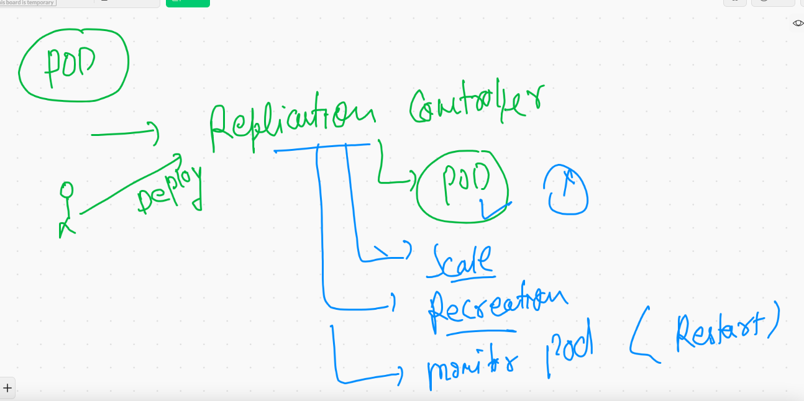
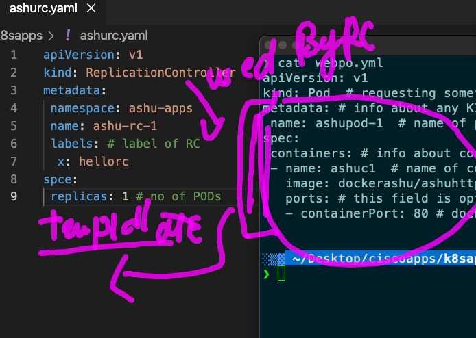
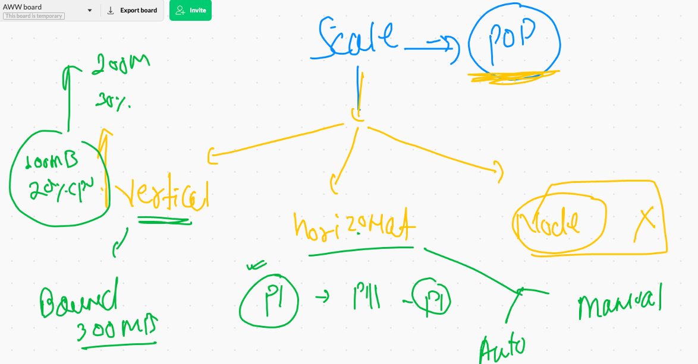
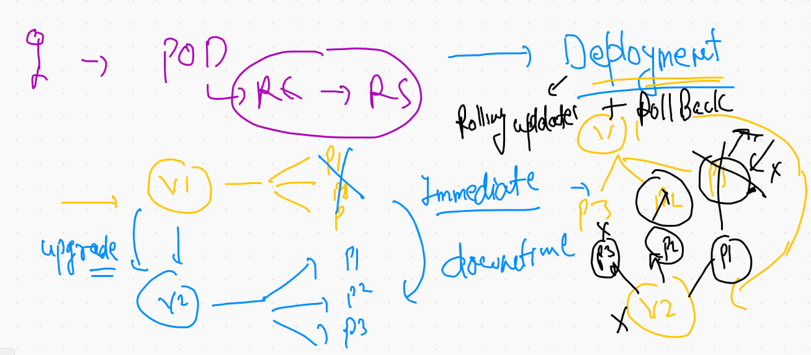
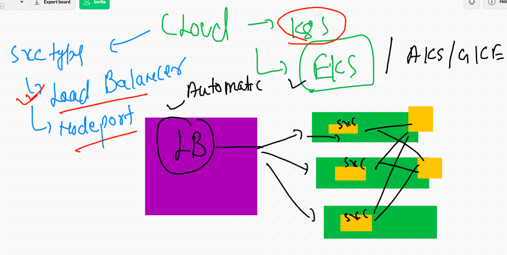
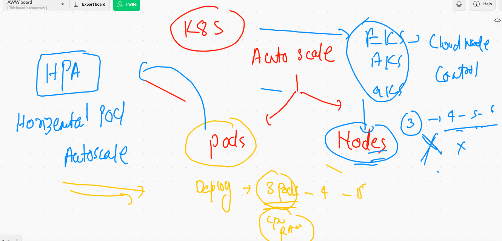

# QUick revision 


## PYthon flask and JSP based application 


## Webapp info 


## Python Flask application build 

```
❯ ls
Dockerfile       README.md        demo.py          requirements.txt static
❯ docker  build  -t  dockerashu/ciscoflask:appv1  .
Sending build context to Docker daemon  87.04kB
Step 1/7 : FROM python
 ---> 5b3b4504ff1f
Step 2/7 : COPY . /app
 ---> f26780fe5180
Step 3/7 : WORKDIR /app
 ---> Running in 3fa5ad4fc454
Removing intermediate container 3fa5ad4fc454
 ---> 1f887d6748b9
Step 4/7 : RUN pip install -r requirements.txt
 ---> Running in 2dd4d5970afb
 
 
 ```

### Image got push to dockerhub 

## switching to k8s cluster 

```
❯ kubectl  config  get-contexts
CURRENT   NAME                          CLUSTER      AUTHINFO           NAMESPACE
          kubernetes-admin@kubernetes   kubernetes   kubernetes-admin   
*         minikube                      minikube     minikube           default
❯ kubectl  config  use-context  kubernetes-admin@kubernetes
Switched to context "kubernetes-admin@kubernetes".
❯ 
❯ kubectl  get  nodes
NAME                           STATUS   ROLES                  AGE   VERSION
ip-172-31-82-89.ec2.internal   Ready    control-plane,master   25h   v1.21.1
ip-172-31-85-18.ec2.internal   Ready    <none>                 25h   v1.21.1
ip-172-31-86-48.ec2.internal   Ready    <none>                 25h   v1.21.1
ip-172-31-89-48.ec2.internal   Ready    <none>                 25h   v1.21.1
❯ kubectl  get  po
NAME           READY   STATUS    RESTARTS   AGE
ashupod3       1/1     Running   1          18h
derpaulpod3    1/1     Running   1          18h
khalidpod111   1/1     Running   1          18h
khalidpod3     1/1     Running   1          17h
manishapod3    1/1     Running   1          17h
sushilpod1     1/1     Running   1          18h
varunpod2      1/1     Running   1          18h
vishnupod-1    1/1     Running   1          17h
vishnupod111   1/1     Running   1          18h
❯ kubectl  delete  pods --all
pod "ashupod3" deleted
pod "derpaulpod3" deleted
pod "khalidpod111" deleted
pod "khalidpod3" deleted
pod "manishapod3" deleted
pod "sushilpod1" deleted
pod "varunpod2" deleted


```


### Generating YAML file 

```
 kubectl   run  ashuflaskpod1   --image=dockerashu/ciscoflask:appv2  --port 5000 --dry-run=client -o yaml
apiVersion: v1
kind: Pod
metadata:
  creationTimestamp: null
  labels:
    run: ashuflaskpod1
  name: ashuflaskpod1
spec:
  containers:
  - image: dockerashu/ciscoflask:appv2
    name: ashuflaskpod1
    ports:
    - containerPort: 5000
    resources: {}
  dnsPolicy: ClusterFirst
  restartPolicy: Always
status: {}
❯ kubectl   run  ashuflaskpod1   --image=dockerashu/ciscoflask:appv2  --port 5000 --dry-run=client -o yaml  >flask.yaml

```

### Deploying POD 

```
❯ ls
ashupod1.yaml flask.yaml    mypod.yml     webpo.yml
❯ kubectl  apply -f   flask.yaml --dry-run=client
pod/ashuflaskpod1 created (dry run)
❯ kubectl  apply -f   flask.yaml
pod/ashuflaskpod1 created

```

### checking label of POds 

```
❯ kubectl  get   po --show-labels
NAME               READY   STATUS    RESTARTS   AGE     LABELS
ashuflaskpod1      1/1     Running   0          9m41s   run=ashuflaskpod1
derpaulflaskpod1   1/1     Running   0          8m15s   run=derpaulflaskpod1
khalidflaskpod1    1/1     Running   0          3m42s   run=khalidflaskpod1
manishaflaskpod1   1/1     Running   0          11m     run=manishaflaskpod1
sushil-flask-pod   1/1     Running   0          3m3s    run=sushil-flask-pod
varunflaskpod1     1/1     Running   0          13m     run=varunflaskpod1
vishnuflaskpod1    1/1     Running   0          8m53s   run=vishnuflaskpod1


❯ kubectl  get   po   ashuflaskpod1   --show-labels
NAME            READY   STATUS    RESTARTS   AGE     LABELS
ashuflaskpod1   1/1     Running   0          9m53s   run=ashuflaskpod1

```

### Nodeport service 


### nodeport service understanding 


### creating nodeport service 


```
❯ kubectl  create  service   nodeport  ashusvc1   --tcp   1234:5000  --dry-run=client -o yaml
apiVersion: v1
kind: Service
metadata:
  creationTimestamp: null
  labels:
    app: ashusvc1
  name: ashusvc1
spec:
  ports:
  - name: 1234-5000
    port: 1234
    protocol: TCP
    targetPort: 5000
  selector:
    app: ashusvc1
  type: NodePort
status:
  loadBalancer: {}
❯ kubectl  create  service   nodeport  ashusvc1   --tcp   1234:5000  --dry-run=client -o yaml  >flaskappsvc.yml

```

### deploy service 

```
❯ kubectl  apply -f  flaskappsvc.yml  --dry-run=client
service/ashusvc1 created (dry run)
❯ kubectl  apply -f  flaskappsvc.yml
service/ashusvc1 created
❯ 
❯ kubectl   get  service
NAME         TYPE        CLUSTER-IP       EXTERNAL-IP   PORT(S)          AGE
ashusvc1     NodePort    10.98.145.129    <none>        1234:30698/TCP   7s
kubernetes   ClusterIP   10.96.0.1        <none>        443/TCP          25h
manishsvc1   NodePort    10.110.245.199   <none>        1234:30234/TCP   79s
sushilsvc1   NodePort    10.108.146.240   <none>        1234:30536/TCP   7s


```

### cleaning up  pods & services 

```
❯ kubectl  delete all  --all
pod "ashishflaskpod1" deleted
pod "ashuflaskpod1" deleted
pod "derpaulflaskpod1" deleted
pod "khalidflaskpod1" deleted
pod "manishaflaskpod1" deleted
pod "sushil-flask-pod" deleted
pod "varunflaskpod1" deleted
pod "vishnuflaskpod1" deleted
service "ashishsvc1" deleted
service "ashusvc1" deleted
service "derpaulsvc1" deleted
service "khalidsvc1" deleted

```


## Namespace information 


### Default is namespace for everyone first time connecting cluster 


### all kubernetes Internal master & Minion COmponent is running as POD 

```
❯ kubectl  get  pods   -n  kube-system
NAME                                                   READY   STATUS    RESTARTS   AGE
calico-kube-controllers-78d6f96c7b-6b5kp               1/1     Running   1          26h
calico-node-2z4vj                                      1/1     Running   1          26h
calico-node-kht62                                      1/1     Running   1          26h
calico-node-tp26t                                      1/1     Running   1          26h
calico-node-vgtk8                                      1/1     Running   1          26h
coredns-558bd4d5db-54b4m                               1/1     Running   1          26h
coredns-558bd4d5db-7x8kc                               1/1     Running   1          26h
etcd-ip-172-31-82-89.ec2.internal                      1/1     Running   1          26h
kube-apiserver-ip-172-31-82-89.ec2.internal            1/1     Running   1          26h
kube-controller-manager-ip-172-31-82-89.ec2.internal   1/1     Running   1          26h
kube-proxy-25t62                                       1/1     Running   1          26h
kube-proxy-jw4rm                                       1/1     Running   1          26h
kube-proxy-lhf8x                                       1/1     Running   1          26h
kube-proxy-qm5tj                                       1/1     Running   1          26h
kube-scheduler-ip-172-31-82-89.ec2.internal            1/1     Running   1          26h

```

### creating namespace 

```
❯ kubectl  create   namespace   ashu-apps   --dry-run=client  -o yaml
apiVersion: v1
kind: Namespace
metadata:
  creationTimestamp: null
  name: ashu-apps
spec: {}
status: {}
❯ kubectl  create   namespace   ashu-apps
namespace/ashu-apps created
❯ kubectl  get   ns
NAME                   STATUS   AGE
ashu-apps              Active   9s
default                Active   26h
kube-node-lease        Active   26h
kube-public            Active   26h
kube-system            Active   26h


```

### Default namespace setting 

```
❯ kubectl  config  set-context    --current  --namespace=ashu-apps
Context "kubernetes-admin@kubernetes" modified.
❯ 
❯ kubectl  config get-contexts
CURRENT   NAME                          CLUSTER      AUTHINFO           NAMESPACE
*         kubernetes-admin@kubernetes   kubernetes   kubernetes-admin   ashu-apps
          minikube                      minikube     minikube           default
❯ kubectl  get  po
No resources found in ashu-apps namespace.

```

# REplication Controller  RC 



## cleaning up namespace 

```
 kubectl  get  all
NAME           READY   STATUS    RESTARTS   AGE
pod/ashupod3   1/1     Running   0          108m

NAME               TYPE       CLUSTER-IP      EXTERNAL-IP   PORT(S)          AGE
service/ashusvc2   NodePort   10.108.101.91   <none>        1234:32331/TCP   108m
❯ kubectl  delete  all  --all
pod "ashupod3" deleted
service "ashusvc2" deleted

```

### Creating RC 



```
❯ kubectl  apply -f  ashurc.yaml
replicationcontroller/ashu-rc-1 created
❯ kubectl  get   rc
NAME          DESIRED   CURRENT   READY   AGE
ashu-rc-1     1         1         1       23s
sushil-rc-1   1         1         1       5s


❯ kubectl  get   po
NAME              READY   STATUS    RESTARTS   AGE
ashu-rc-1-tk6sj   1/1     Running   0          58s
❯ kubectl delete  pod ashu-rc-1-tk6sj
pod "ashu-rc-1-tk6sj" deleted
❯ kubectl  get   po
NAME              READY   STATUS    RESTARTS   AGE
ashu-rc-1-kvjzg   1/1     Running   0          7s


```

###  another way to create service 



### manual pod scaling 

```
❯ kubectl  get  rc
NAME        DESIRED   CURRENT   READY   AGE
ashu-rc-1   1         1         1       16m
❯ kubectl  apply -f  ashurc.yaml
replicationcontroller/ashu-rc-1 configured
service/ashusvc1 configured
❯ kubectl  get  rc
NAME        DESIRED   CURRENT   READY   AGE
ashu-rc-1   2         2         2       16m
❯ kubectl  get po
NAME              READY   STATUS    RESTARTS   AGE
ashu-rc-1-726q5   1/1     Running   0          12s
ashu-rc-1-kvjzg   1/1     Running   0          15m
❯ kubectl  scale  rc  ashu-rc-1  --replicas=5
replicationcontroller/ashu-rc-1 scaled
❯ kubectl  get po
NAME              READY   STATUS    RESTARTS   AGE
ashu-rc-1-5hw8m   1/1     Running   0          3s
ashu-rc-1-726q5   1/1     Running   0          71s
ashu-rc-1-kvjzg   1/1     Running   0          16m
ashu-rc-1-m45ms   1/1     Running   0          3s
ashu-rc-1-skgrg   1/1     Running   0          3s


```

## Overall to deploy application in form of POD -- we use Deployments

# Deployment 



### Deployment  reality 


### Deployment of deployment 

```
❯ kubectl  apply -f  ashudep1.yaml
deployment.apps/ashudep1 created
service/ashusvc1 created
❯ kubectl  get  deploy
NAME       READY   UP-TO-DATE   AVAILABLE   AGE
ashudep1   1/1     1            1           11s
❯ kubectl  get  rs
NAME                  DESIRED   CURRENT   READY   AGE
ashudep1-766f5b7789   1         1         1       19s
❯ kubectl  get  pod
NAME                        READY   STATUS    RESTARTS   AGE
ashudep1-766f5b7789-tcm6w   1/1     Running   0          24s
❯ kubectl  get  svc
NAME       TYPE       CLUSTER-IP    EXTERNAL-IP   PORT(S)          AGE
ashusvc1   NodePort   10.99.19.12   <none>        1234:32396/TCP   28s


```

### NOdeport & Loadbalancer they are same in non cloud based k8s 

```
❯ kubectl  get  deploy
NAME       READY   UP-TO-DATE   AVAILABLE   AGE
ashudep1   2/2     2            2           45m
❯ kubectl  get  svc
NAME       TYPE       CLUSTER-IP    EXTERNAL-IP   PORT(S)          AGE
ashusvc1   NodePort   10.99.19.12   <none>        1234:32396/TCP   45m
❯ kubectl  expose deployment ashudep1  --type LoadBalancer  --port 1234 --target-port 80 --name ashusvc111
service/ashusvc111 exposed
❯ kubectl  get  svc
NAME         TYPE           CLUSTER-IP     EXTERNAL-IP   PORT(S)          AGE
ashusvc1     NodePort       10.99.19.12    <none>        1234:32396/TCP   45m
ashusvc111   LoadBalancer   10.108.107.2   <pending>     1234:30680/TCP   5

```

## loadbalancer type service 




### checking image details 

```
❯ kubectl  describe  deploy  ashudep1
Name:                   ashudep1
Namespace:              ashu-apps
CreationTimestamp:      Thu, 10 Jun 2021 15:37:29 +0530
Labels:                 app=ashudep1
Annotations:            deployment.kubernetes.io/revision: 1
Selector:               app=ashudep1
Replicas:               3 desired | 3 updated | 3 total | 3 available | 0 unavailable
StrategyType:           RollingUpdate
MinReadySeconds:        0
RollingUpdateStrategy:  25% max unavailable, 25% max surge
Pod Template:
  Labels:  app=ashudep1
  Containers:
   ashuhttp:
    Image:        dockerashu/ashuhttp:ciscowebv1
    Port:         <none>
    Host Port:    <none>
    Environment:  <none>
    Mounts:       <none>

```

### setting image in a running deployment 

```
kubectl   set  image  deployment  ashudep1  ashuhttp=dockerashu/ashuhttp:ciscowebv2

```

## Auto scaling in k8s 



## HPA 

#### Need 1 . Metric server 2. Cgourps in POD 

## link of MEtrics server 

[metrics](https://github.com/kubernetes-sigs/metrics-server)

###  HPA 

```
10116  kubectl autoscale deployment  webapp  --min=1  --max=30 --cpu-percent=80 
10117  kubectl  get  hpa

```


