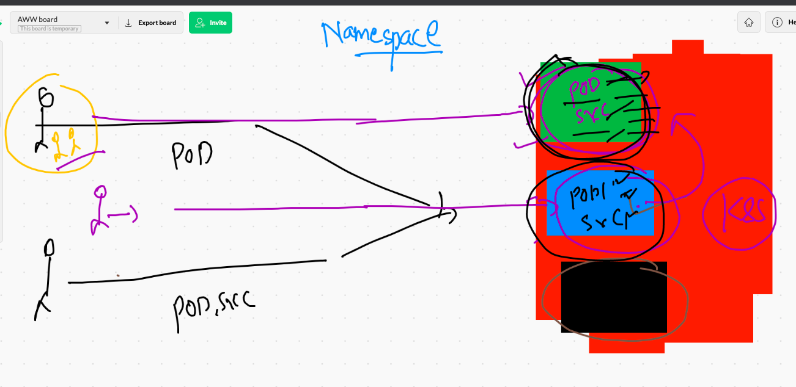

# Introduction to Namespace and Cgroups 


## Switching context. 

```
❯ docker  context  ls
NAME                TYPE                DESCRIPTION                               DOCKER ENDPOINT               KUBERNETES ENDPOINT                 ORCHESTRATOR
awsDE               moby                                                          ssh://cisco@54.156.100.112                                        
default *           moby                Current DOCKER_HOST based configuration   unix:///var/run/docker.sock   https://127.0.0.1:57644 (default)   swarm
❯ docker  context  use  awsDE
awsDE
❯ docker  context  ls
NAME                TYPE                DESCRIPTION                               DOCKER ENDPOINT               KUBERNETES ENDPOINT                 ORCHESTRATOR
awsDE *             moby                                                          ssh://cisco@54.156.100.112                                        
default             moby                Current DOCKER_HOST based configuration   unix:///var/run/docker.sock   https://127.0.0.1:57644 (default)   swarm

```

## Namespace the backbone of container creation process 



## Cgroups in container 


```
❯ docker  run  -itd --name  ashuc2  --memory 100M   busybox  ping fb.com
Unable to find image 'busybox:latest' locally
latest: Pulling from library/busybox
b71f96345d44: Pull complete 
Digest: sha256:930490f97e5b921535c153e0e7110d251134cc4b72bbb8133c6a5065cc68580d
Status: Downloaded newer image for busybox:latest
90e815db6f6493ed87438d48181bec76ca1efab0552d458f0734e7d14cfc9e4e
❯ docker  ps
CONTAINER ID   IMAGE            COMMAND                CREATED          STATUS          PORTS                  NAMES
90e815db6f64   busybox          "ping fb.com"          5 seconds ago    Up 3 seconds                           ashuc2
3c93475e5f39   alpine           "ping 127.0.0.1"       3 minutes ago    Up 3 minutes                           ashuc123
d04209cc5c93   varunhttp:v002   "httpd -DFOREGROUND"   56 minutes ago   Up 56 minutes   0.0.0.0:8501->80/tcp   varunwebC2


```

### checking resources

```
docker stats 

CONTAINER ID   NAME         CPU %     MEM USAGE / LIMIT    MEM %     NET I/O           BLOCK I/O     PIDS
90e815db6f64   ashuc2       0.01%     640KiB / 100MiB      0.62%     12.5kB / 11.6kB   0B / 0B       1
3c93475e5f39   ashuc123     0.01%     1.523MiB / 7.69GiB   0.02%     978B / 0B         1.24MB / 0B   1
d04209cc5c93   varunwebC2   0.11%     19.87MiB / 7.69GiB   0.25%     1.63kB / 0B       15MB / 0B     213
^C%                 

```

## Restart policy 


## checking restart policy 

```
 docker  inspect  varunwebC2   --format='{{.HostConfig.RestartPolicy.Name}}'    

```

### name of restart policies 


## setting restart policy to a container 

```
❯ docker  run -itd --name helloc1  --restart  always  busybox ping localhost
82e7eae217034ec3c9f4c9011f74e56a0687c5f6080fb6044a486f6e73e709e1
❯ docker  inspect  helloc1   --format='{{.HostConfig.RestartPolicy.Name}}'
always

```


