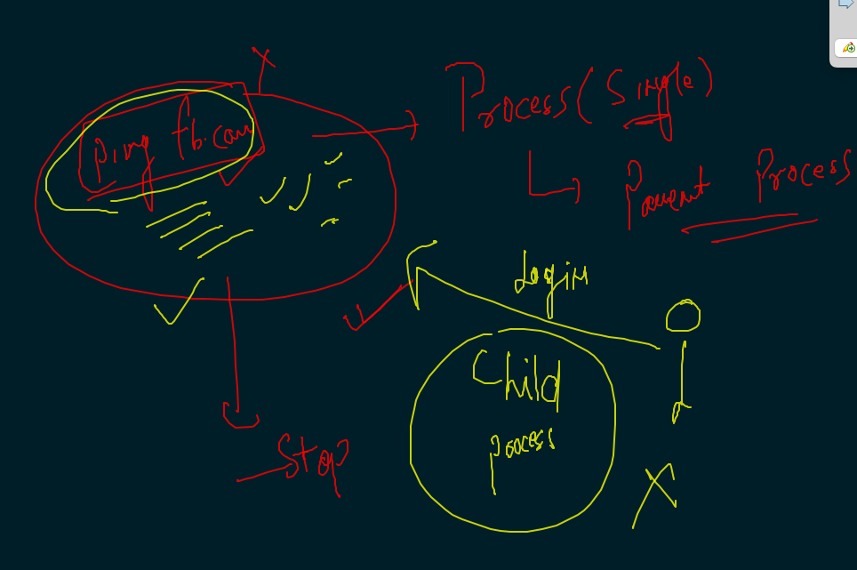
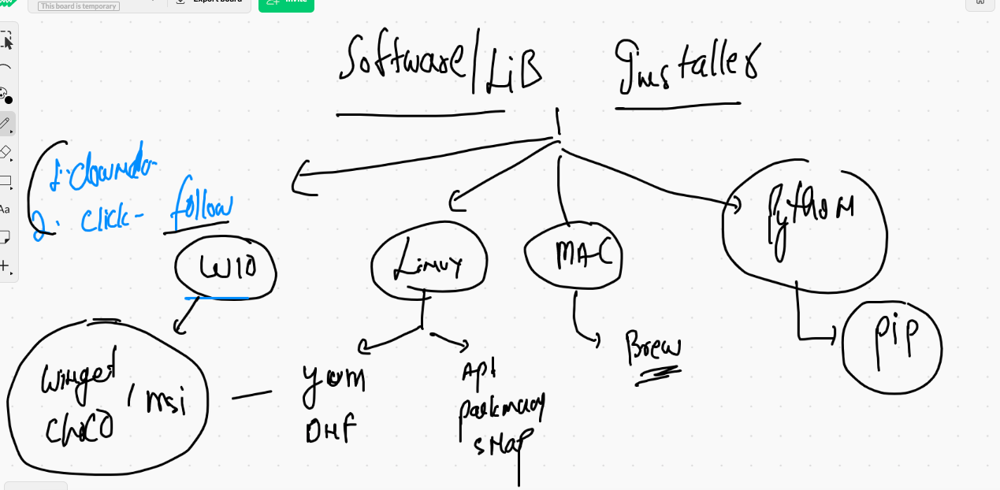

# Getting started with Docker based containerization 

## app deployment in history


## app deployment probl


## solution to bare-metal based app deployment is Virtualization 


## COntainers into the picture 


## COntainers are not having any kernel 


# CRE vs hypervisor 


## Docker desktop 


## Docker Dekstop link 

[MAC](https://docs.docker.com/docker-for-mac/install/)


===


[Windows10](https://docs.docker.com/docker-for-windows/install/)


## after installation  checking 

```
❯ docker  version
Client:
 Cloud integration: 1.0.14
 Version:           20.10.6
 API version:       1.41
 Go version:        go1.16.3
 Git commit:        370c289
 Built:             Fri Apr  9 22:46:57 2021
 OS/Arch:           darwin/amd64
 Context:           default
 Experimental:      true

Server: Docker Engine - Community
 Engine:
  Version:          20.10.6
  API version:      1.41 (minimum version 1.12)
  Go version:       go1.13.15
  Git commit:       8728dd2
  Built:            Fri Apr  9 22:44:56 2021
  OS/Arch:          linux/amd64
  Experimental:     false
 containerd:
  Version:          1.4.4
  GitCommit:        05f951a3781f4f2c1911b05e61c160e9c30eaa8e
 runc:
  Version:          1.0.0-rc93
  GitCommit:        12644e614e25b05da6fd08a38ffa0cfe1903fdec
 docker-init:
  Version:          0.19.0
  GitCommit:        de40ad0


```

## Docker architecture 


## docker client options 


## Introduction to docker images


## final working of creating containers


## sending instruction to container ENgine 

### search 

```
❯ docker  search  python
NAME                             DESCRIPTION                                     STARS     OFFICIAL   AUTOMATED
python                           Python is an interpreted, interactive, objec…   6213      [OK]       
django                           Django is a free web application framework, …   1077      [OK]       
pypy                             PyPy is a fast, compliant alternative implem…   275       [OK]       
nikolaik/python-nodejs           Python with Node.js                             76                   [OK]
joyzoursky/python-chrom

```

### pulling image from docker hub 

```
❯ docker  pull  openjdk
Using default tag: latest
latest: Pulling from library/openjdk
5a581c13a8b9: Pull complete 
26cd02acd9c2: Pull complete 
66727af51578: Pull complete 
Digest: sha256:94f743e9cd673023f1035f646d3dfb52716419524ec377308676ad442b03d0d5
Status: Downloaded newer image for openjdk:latest
docker.io/library/openjdk:latest

```

### checking number of images stored into docker host system 

```

❯ docker   images
REPOSITORY                    TAG             IMAGE ID       CREATED        SIZE
dockerashu/httpd              jcimultiappv2   5d6af4000f85   4 days ago     251MB
openjdk                       latest          de085dce79ff   4 days ago     467MB
sagar26/sagarapp1             newapp1         37c850620381   4 days ago     251MB
dockerashu/httpd              jcimultiappv1   c85999e79872   5 days ago     251MB
busybox                       latest          d3cd072556c2   2 weeks ago    1.24MB
fedora                        latest          055b2e5ebc94   3 weeks ago    178MB

```

### pull few more images

```
❯ docker  pull  busybox
Using default tag: latest
latest: Pulling from library/busybox
Digest: sha256:b5fc1d7b2e4ea86a06b0cf88de915a2c43a99a00b6b3c0af731e5f4c07ae8eff
Status: Image is up to date for busybox:latest
docker.io/library/busybox:latest
❯ docker  pull  alpine
Using default tag: latest
latest: Pulling from library/alpine
Digest: sha256:69e70a79f2d41ab5d637de98c1e0b055206ba40a8145e7bddb55ccc04e13cf8f
Status: Image is up to date for alpine:latest
docker.io/library/alpine:latest

```

## container need only single process to run in idle cases 


## few seconds to create container 

```
❯ docker  run  --name  ashuc1   alpine:latest    ping google.com
PING google.com (216.58.196.206): 56 data bytes
64 bytes from 216.58.196.206: seq=0 ttl=37 time=50.504 ms
64 bytes from 216.58.196.206: seq=1 ttl=37 time=51.063 ms
64 bytes from 216.58.196.206: seq=2 ttl=37 time=55.891 ms
64 bytes from 216.58.196.206: seq=3 ttl=37 time=49.540 ms

```

### Installing Docker IN aws Linux server 

```
    6  yum   install  docker  -y
    7  history 
[root@ip-172-31-27-216 ~]# 
[root@ip-172-31-27-216 ~]# 
[root@ip-172-31-27-216 ~]# systemctl start  docker 
[root@ip-172-31-27-216 ~]# systemctl enable  docker 
Created symlink from /etc/systemd/system/multi-user.target.wants/docker.service to /usr/lib/systemd/system/docker.service.
[root@ip-172-31-27-216 ~]# systemctl status docker 
[root@ip-172-31-27-216 ~]# systemctl status docker 
● docker.service - Docker Application Container Engine
   Loaded: loaded (/usr/lib/systemd/system/docker.service; enabled; vendor preset: disabled)
   Active: active (running) since Mon 2021-06-07 07:03:04 UTC; 17s ago
     Docs: https://docs.docker.com
 Main PID: 3171 (dockerd)
   CGroup: /system.slice/docker.service

```

## Docker client can connect to multiple docker engines using contexts 


### from client side check context 

```
❯ docker  context   ls
NAME                TYPE                DESCRIPTION                               DOCKER ENDPOINT               KUBERNETES ENDPOINT                 ORCHESTRATOR
default *           moby                Current DOCKER_HOST based configuration   unix:///var/run/docker.sock   https://127.0.0.1:57644 (default)   swarm

```

## to make passwordless connection 

### client is generating ssh key pair

```
❯ ssh-keygen
Generating public/private rsa key pair.
Enter file in which to save the key (/Users/fire/.ssh/id_rsa): 
/Users/fire/.ssh/id_rsa already exists.
Overwrite (y/n)? y
Enter passphrase (empty for no passphrase): 
Enter same passphrase again: 
Your identification has been saved in /Users/fire/.ssh/id_rsa.
Your public key has been saved in /Users/fire/.ssh/id_rsa.pub.
The key fingerprint is:
SHA256:XwUToZdG3W5JbpaLM2UPTHn90Ez4mVEWaFys6yCd6Z4 fire@ashutoshhs-MacBook-Air.local
The key's randomart image is:
+---[RSA 3072]----+
|            B++XB|
|           o B*=*|
|          . =o==B|
|           o oo@=|
|        S . + Boo|
|         o * = ..|
|          + o o  |
|           ...   |
|          .E     |
+----[SHA256]-----+

```

### sharing public key to remote docker engine user

```
❯ ssh-copy-id     cisco@54.156.100.112
/usr/bin/ssh-copy-id: INFO: Source of key(s) to be installed: "/Users/fire/.ssh/id_rsa.pub"
/usr/bin/ssh-copy-id: INFO: attempting to log in with the new key(s), to filter out any that are already installed
/usr/bin/ssh-copy-id: INFO: 1 key(s) remain to be installed -- if you are prompted now it is to install the new keys
/etc/profile.d/lang.sh: line 19: warning: setlocale: LC_CTYPE: cannot change locale (UTF-8): No such file or directory

Number of key(s) added:        1

Now try logging into the machine, with:   "ssh 'cisco@54.156.100.112'"
and check to make sure that only the key(s) you wanted were added.

```

### now creating contexts 

```
❯ docker  context  create   awsDE   --docker  host="ssh://cisco@54.156.100.112"
awsDE
Successfully created context "awsDE"
❯ docker  context  ls
NAME                TYPE                DESCRIPTION                               DOCKER ENDPOINT               KUBERNETES ENDPOINT                 ORCHESTRATOR
awsDE               moby                                                          ssh://cisco@54.156.100.112                                        
default *           moby                Current DOCKER_HOST based configuration   unix:///var/run/docker.sock   https://127.0.0.1:57644 (default)   swarm


```


### switching into the context 

```
❯ docker  context   use  awsDE
awsDE
❯ docker  context ls
NAME                TYPE                DESCRIPTION                               DOCKER ENDPOINT               KUBERNETES ENDPOINT                 ORCHESTRATOR
awsDE *             moby                                                          ssh://cisco@54.156.100.112                                        
default             moby                Current DOCKER_HOST based configuration   unix:///var/run/docker.sock   https://127.0.0.1:57644 (default)   swarm


```

### now all labs practice will be doing in Remote docker engine 

```
❯ docker  images
REPOSITORY   TAG       IMAGE ID       CREATED       SIZE
node         latest    d1b3088a17b1   3 days ago    908MB
alpine       latest    6dbb9cc54074   7 weeks ago   5.61MB
❯ 

❯ docker  run  --name  ashuc1 -d    alpine   ping fb.com
da0d4145137633dd37fc2b7070c75fe6164cc0b863da87fc8cac91bdd3c7fe0f
❯ docker  ps
CONTAINER ID   IMAGE     COMMAND             CREATED          STATUS          PORTS     NAMES
fc9b597a64af   alpine    "ping google.com"   8 seconds ago    Up 3 seconds              varunCont1
da0d41451376   alpine    "ping fb.com"       32 seconds ago   Up 29 seconds             ashuc1

```

### parent process outout checking 

```
❯ docker  logs   ashuc1
PING fb.com (157.240.229.35): 56 data bytes
64 bytes from 157.240.229.35: seq=0 ttl=50 time=0.556 ms
64 bytes from 157.240.229.35: seq=1 ttl=50 time=0.580 ms
64 bytes from 157.240.229.35: seq=2 ttl=50 time=0.612 ms
64 bytes from 157.240.229.35: seq=3 ttl=50 time=0.581 ms

```

### checking resources consumption of a running container 

```
docker stats ashuc1

CONTAINER ID   NAME      CPU %     MEM USAGE / LIMIT   MEM %     NET I/O           BLOCK I/O   PIDS
da0d41451376   ashuc1    0.01%     708KiB / 7.69GiB    0.01%     36.2kB / 34.5kB   0B / 0B     1
^C%                                                                                                                             

```

### stopping a container manually 

```
❯ docker   stop  ashuc1
ashuc1


```

### list of all containers 

```
❯ docker  ps   -a
CONTAINER ID   IMAGE           COMMAND             CREATED         STATUS                            PORTS     NAMES
885ec697613b   alpine:latest   "ping fb.com"       3 minutes ago   Up 3 minutes                                ashish1
78fcc3554bfd   alpine          "ping google.com"   4 minutes ago   Up 4 minutes                                derpaul
960b404763d3   alpine:latest   "ping fb.com"       5 minutes ago   Exited (0) 5 minutes ago                    ashish
61f50fa4c803   hello-world     "/hello"            5 minutes ago   Exited (0) 5 minutes ago                    keen_mclean
da30d8d55f51   alpine          "ping 127.0.0.1"    6 minutes ago   Up 5 minutes                                ngar
5a8f35b29f02   alpine          "ping yahoo.com"    6 minutes ago   Exited (137) 58 seconds ago                 sushil
4cb39918d494   alpine          "ping gmail.com"    6 minutes ago   Exited (137) 57 seconds ago                 test1
375052561fd9   hello-world     "/hello"            7 minutes ago   Exited (0) 7 minutes ago                    vibrant_heisenberg

```

## starting a stopped container 

```
❯ docker  start  ashuc1
ashuc1
❯ docker  ps
CONTAINER ID   IMAGE           COMMAND             CREATED         STATUS         PORTS     NAMES
885ec697613b   alpine:latest   "ping fb.com"       4 minutes ago   Up 4 minutes             ashish1
78fcc3554bfd   alpine          "ping google.com"   5 minutes ago   Up 5 minutes             derpaul
da0d41451376   alpine          "ping fb.com"       9 minutes ago   Up 3 seconds             ashuc1

```

## a child process inside a running container is also possible 




### doing exec 

```
❯ docker   exec  -it   ashuc1  sh
/ # ls
bin    dev    etc    home   lib    media  mnt    opt    proc   root   run    sbin   srv    sys    tmp    usr    var
/ # ifconfig 
eth0      Link encap:Ethernet  HWaddr 02:42:AC:11:00:02  
          inet addr:172.17.0.2  Bcast:172.17.255.255  Mask:255.255.0.0
          UP BROADCAST RUNNING MULTICAST  MTU:1500  Metric:1
          RX packets:541 errors:0 dropped:0 overruns:0 frame:0
          TX packets:521 errors:0 dropped:0 overruns:0 carrier:0
          collisions:0 txqueuelen:0 
          RX bytes:50770 (49.5 KiB)  TX bytes:49426 (48.2 KiB)

lo        Link encap:Local Loopback  
          inet addr:127.0.0.1  Mask:255.0.0.0
          UP LOOPBACK RUNNING  MTU:65536  Metric:1
          RX packets:0 errors:0 dropped:0 overruns:0 frame:0
          TX packets:0 errors:0 dropped:0 overruns:0 carrier:0
          collisions:0 txqueuelen:1000 
          RX bytes:0 (0.0 B)  TX bytes:0 (0.0 B)

/ # exit


```

### removing container permanently 

```

❯ docker   stop   ashuc1
ashuc1
❯ docker  rm  ashuc1
ashuc1


```

## all docker. basic required operations are done 


## COntainerization of any application 

## Code/app --- Dockerfile -- Build -- image -- container 


### SOFTWARE installer introduction 



### Build first docker image 

```
❯ cd python
❯ ls
Dockerfile hello.py
❯ docker  build  -t  ashucisco:pycodev1  .
Sending build context to Docker daemon  3.584kB
Step 1/6 : FROM centos
 ---> 300e315adb2f
Step 2/6 : MAINTAINER  ashutoshh@linux.com
 ---> Running in e9f9e1011b6b
Removing intermediate container e9f9e1011b6b
 ---> d39e6cda7cd1
Step 3/6 : RUN  yum install python3 -y
 ---> Running in 97118b0c1849
CentOS Linux 8 - AppStream                       31 MB/s | 7.4 MB     00:00    
CentOS Linux 8 - BaseOS                          46 MB/s | 2.6 MB     00:00    
CentOS Linux 8 - Extras                      


```

### checking images 

```
 docker   images
REPOSITORY    TAG        IMAGE ID       CREATED              SIZE
varunfirst    python     5bfbbfb82f32   1 second ago         252MB
vishnucisco   pycodev    ebba736a45ad   23 seconds ago       252MB
sushil_p      1.0.0      c93c4a3efff9   About a minute ago   252MB
ashucisco     pycodev1   640ebf86fb2b   About a minute ago   252MB

```

### creating container from that docker image

```
❯ docker  run  -itd  --name  ashuc2  ashucisco:pycodev1
a53c07b5114ec2d62b4da166aadd397e79505a69afc8ae5d44ed8d4fff921eed
❯ docker  ps
CONTAINER ID   IMAGE                COMMAND                  CREATED          STATUS          PORTS     NAMES
a53c07b5114e   ashucisco:pycodev1   "python3 /mydata/hel…"   35 seconds ago   Up 34 seconds             ashuc2

```

### to check output of default process

```
docker  logs  -f   ashuc2 
```


