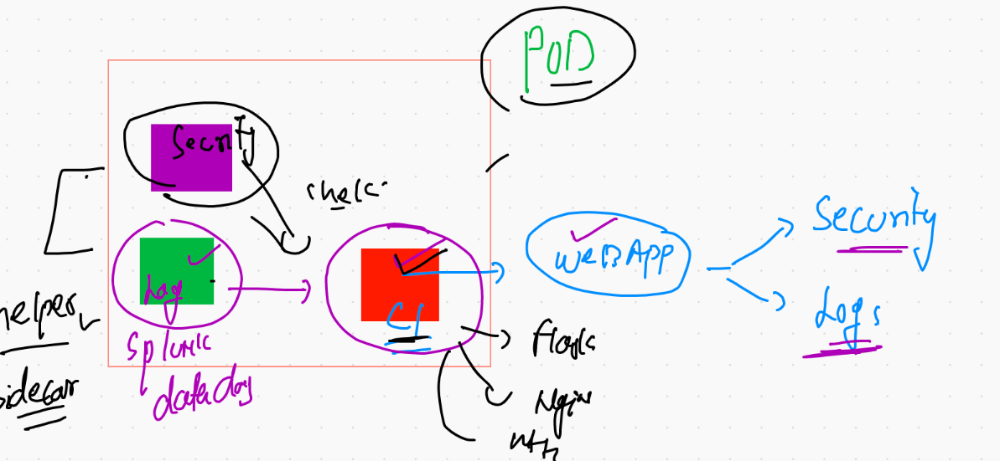

## Cname COncept in DNS with K8s 


## k8s certification tracks 


# k8s storage concept 


[volumes](https://kubernetes.io/docs/concepts/storage/volumes/)


## Creating and mounting volumes 


### emptyDIr example 

```
❯ kubectl  apply -f  empvol.yaml --dry-run=client
pod/ashupod11 created (dry run)
❯ kubectl  apply -f  empvol.yaml
pod/ashupod11 created
❯ kubectl  get  po
NAME        READY   STATUS    RESTARTS   AGE
ashupod11   1/1     Running   0  

```

### Describe POd 

```
❯ kubectl  describe  pod ashupod11
Name:         ashupod11
Namespace:    ashu-apps
Priority:     0
Node:         ip-172-31-85-18.ec2.internal/172.31.85.18
Start Time:   Fri, 11 Jun 2021 11:18:35 +0530
Labels:       run=ashupod11
Annotations:  cni.projectcalico.org/podIP: 192.168.10.172/32
              cni.projectcalico.org/podIPs: 192.168.10.172/32
Status:       Running
IP:           192.168.10.172
IPs:
  IP:  192.168.10.172
Containers:
  ashupod11:
    Container ID:  docker://453bfb5129a010accd0e491470e3e36706c1e5433c1793da1976158f2b4dda72
    Image:         alpine
    Image ID:      docker-pullable://alpine@sha256:69e70a79f2d41ab5d637de98c1e0b055206ba40a8145e7bddb55ccc04e13cf8f
    Port:          <none>
    Host Port:     <none>
    Command:
      sh
      -c
      while true;do date  >>/mnt/cisco/data.txt;sleep 5;done
    State:          Running


```

### Data writing in Node 

```
❯ kubectl  exec -it  ashupod11  -- sh
/ # cd  /mnt/cisco/
/mnt/cisco # ls
data.txt
/mnt/cisco # wc -l data.txt 
150 data.txt
/mnt/cisco # wc -l data.txt 
151 data.txt
/mnt/cisco # wc -l data.txt 
151 data.txt
/mnt/cisco # wc -l data.txt 
152 data.txt
/mnt/cisco # wc -l data.txt 
152 data.txt
/mnt/cisco # wc -l data.txt 
152 data.txt
/mnt/cisco # wc -l data.txt 
153 data.txt
/mnt/cisco # exit


```

### Multi container POD 




### accessing container 

```
❯ kubectl exec  -it  ashupod11  --  bash
Defaulted container "ashuwebc1" out of: ashuwebc1, ashupod11
root@ashupod11:/# 
root@ashupod11:/# cat  /etc/os-release 
PRETTY_NAME="Debian GNU/Linux 10 (buster)"
NAME="Debian GNU/Linux"
VERSION_ID="10"
VERSION="10 (buster)"
VERSION_CODENAME=buster
ID=debian
HOME_URL="https://www.debian.org/"
SUPPORT_URL="https://www.debian.org/support"
BUG_REPORT_URL="https://bugs.debian.org/"
root@ashupod11:/# cd /usr/share/nginx/html/
root@ashupod11:/usr/share/nginx/html# ls
data.txt
root@ashupod11:/usr/share/nginx/html# rm data.txt 
rm: cannot remove 'data.txt': Read-only file system
root@ashupod11:/usr/share/nginx/html# cat  data.txt 
Fri Jun 11 06:40:06 UTC 2021
Fri Jun 11 06:40:11 UTC 2021


====

10051  kubectl exec  -it  ashupod11  --  bash 
10052  kubectl exec  -it  ashupod11 -c  ashupod11  --  sh  

```


### svc creation using expose of POD 

```
❯ kubectl  get  po  --show-labels
NAME        READY   STATUS    RESTARTS   AGE     LABELS
ashupod11   2/2     Running   0          9m56s   run=ashupod11
❯ kubectl  expose  pod ashupod11  --type LoadBalancer   --port 80   --name ashusvc1
service/ashusvc1 exposed
❯ kubectl get  svc
NAME       TYPE           CLUSTER-IP     EXTERNAL-IP   PORT(S)        AGE
ashusvc1   LoadBalancer   10.97.52.166   <pending>     80:32405/TCP   8s


```


## Demo of two pod microservice 


### Introduction to secret 


### creating secret 

```
❯ kubectl   create  secret   generic  ashusec1   --from-literal  sqlpd=CiscoDB087
secret/ashusec1 created
❯ kubectl  get  secret
NAME                  TYPE                                  DATA   AGE
ashusec1              Opaque                                1      10s

```

### Deploydb POD using deployment 

```
❯ kubectl  apply -f  microsvcdemo.yaml --dry-run=client
deployment.apps/ashudb created (dry run)
❯ kubectl  apply -f  microsvcdemo.yaml
deployment.apps/ashudb created

```

### creating endpoint for DB pod

```
 kubectl  expose  deployment  ashudb  --type ClusterIP --port 3306 --namespace ashu-apps  --dry-run=client -o yaml
apiVersion: v1
kind: Service
metadata:
  creationTimestamp: null
  labels:
    app: ashudb
  name: ashudb
  namespace: ashu-apps
spec:
  ports:
  - port: 3306
    protocol: TCP
    targetPort: 3306
  selector:
    app: ashudb
  type: ClusterIP
status:
  loadBalancer: {}


```

### creating service 

```
❯ kubectl apply -f  microsvcdemo.yaml
Warning: resource deployments/ashudb is missing the kubectl.kubernetes.io/last-applied-configuration annotation which is required by kubectl apply. kubectl apply should only be used on resources created declaratively by either kubectl create --save-config or kubectl apply. The missing annotation will be patched automatically.
deployment.apps/ashudb configured
service/ashudb created
❯ 
❯ kubectl  get deploy
NAME     READY   UP-TO-DATE   AVAILABLE   AGE
ashudb   1/1     1            1           7m48s
❯ kubectl  get pod
NAME                     READY   STATUS    RESTARTS   AGE
ashudb-b99788cd4-v9lc9   1/1     Running   0          7m54s
❯ kubectl  get svc
NAME     TYPE        CLUSTER-IP      EXTERNAL-IP   PORT(S)    AGE
ashudb   ClusterIP   10.110.137.95   <none>        3306/TCP   35s

```


### creating deployment for webapp 

```
❯ kubectl  create  deployment  mywebapp  --image=wordpress:4.8-apache --namespace ashu-space --dry-run=client -o yaml
apiVersion: apps/v1
kind: Deployment
metadata:
  creationTimestamp: null
  labels:
    app: mywebapp
  name: mywebapp
  namespace: ashu-space
spec:
  replicas: 1
  selector:
    matchLabels:
      app: mywebapp
  strategy: {}
  template:
    metadata:
      creationTimestamp: null
      labels:
        app: mywebapp
    spec:
      containers:
      - image: wordpress:4.8-apache
        name: wordpress
        resources: {}
status: {}


```

### final deployment 

```
❯ kubectl apply -f  microsvcdemo.yaml
deployment.apps/ashudb configured
service/ashudb configured
deployment.apps/mywebapp configured
service/websvc1 created
❯ kubectl  get  deploy,pod,svc
NAME                       READY   UP-TO-DATE   AVAILABLE   AGE
deployment.apps/ashudb     1/1     1            1           88m
deployment.apps/mywebapp   1/1     1            1           2m4s

NAME                            READY   STATUS    RESTARTS   AGE
pod/ashudb-b99788cd4-v9lc9      1/1     Running   0          88m
pod/mywebapp-6f678f8dcb-wv5d6   1/1     Running   0          2m5s

NAME              TYPE        CLUSTER-IP      EXTERNAL-IP   PORT(S)        AGE
service/ashudb    ClusterIP   10.110.137.95   <none>        3306/TCP       80m
service/websvc1   NodePort    10.106.89.131   <none>        80:32039/TCP   9s

```

# Security view in k8s 


## Pre-requisite to enforce network policy in k8s 


## links for YAML and rules for NEtwork policy 

[github](https://github.com/ahmetb/kubernetes-network-policy-recipes) <br/>
[calico_official](https://docs.projectcalico.org/security/kubernetes-network-policy)

## k8s  cluster security best practice. ---


## Service Account info 

```
❯ kubectl  config  get-contexts
CURRENT   NAME                          CLUSTER      AUTHINFO           NAMESPACE
*         kubernetes-admin@kubernetes   kubernetes   kubernetes-admin   ashu-apps
          minikube                      minikube     minikube           default
❯ kubectl   get  serviceaccount
NAME      SECRETS   AGE
default   1         27h
❯ kubectl   get  sa
NAME      SECRETS   AGE
default   1         27h
❯ 
❯ kubectl   get  secret
NAME                  TYPE                                  DATA   AGE
ashusec1              Opaque                                1      160m
default-token-68247   kubernetes.io/service-account-token   3      27h
❯ kubectl   describe   secret  default-token-68247
Name:         default-token-68247
Namespace:    ashu-apps
Labels:       <none>
Annotations:  kubernetes.io/service-account.name: default
              kubernetes.io/service-account.uid: 8c579bb3-30b3-4ed7-92c2-6fcfb007c5a0

Type:  kubernetes.io/service-account-token

Data
====
ca.crt:     1066 bytes
namespace:  9 bytes
token:      eyJhbGciOiJSUzI1NiIsImtpZCI6InhXV19PU0JVSkJYYm9BV21ieXhNUF9VdmI5T1hZQy0zcHdKTXFIQXp5VzgifQ.eyJpc3MiOiJrdWJlcm5ldGVzL3NlcnZpY2VhY2NvdW50Iiwia3ViZXJuZXRlcy5pby9zZ

```

## Creating a. restricted access for particular user or team 

### checking config file 

```
❯ kubectl  config  view
apiVersion: v1
clusters:
- cluster:
    certificate-authority-data: DATA+OMITTED
    server: https://52.73.214.189:6443
  name: kubernetes
- cluster:
    certificate-authority: /Users/fire/.minikube/ca.crt
    extensions:
    - extension:
        last-update: Wed, 09 Jun 2021 13:41:46 IST
        provider: minikube.sigs.k8s.io
        version: v1.20.0
      name: cluster_info

```


### ABove file is not having any permission bcz service account got created very new 

## Creating role for specific namespace


## RBAC 


## Deploy k8s dashboard 

```
❯ kubectl apply -f https://raw.githubusercontent.com/kubernetes/dashboard/v2.2.0/aio/deploy/recommended.yaml
namespace/kubernetes-dashboard created
serviceaccount/kubernetes-dashboard created
service/kubernetes-dashboard created
secret/kubernetes-dashboard-certs created
secret/kubernetes-dashboard-csrf created
secret/kubernetes-dashboard-key-holder created
configmap/kubernetes-dashboard-settings created
role.rbac.authorization.k8s.io/kubernetes-dashboard created
clusterrole.rbac.authorization.k8s.io/kubernetes-dashboard unchanged
rolebinding.rbac.authorization.k8s.io/kubernetes-dashboard created
clusterrolebinding.rbac.authorization.k8s.io/kubernetes-dashboard unchanged
deployment.apps/kubernetes-dashboard created
service/dashboard-metrics-scraper created
deployment.apps/dashboard-metrics-scraper created


```

### exploring dashboard 

```
❯ kubectl  get  deploy  -n  kubernetes-dashboard
NAME                        READY   UP-TO-DATE   AVAILABLE   AGE
dashboard-metrics-scraper   1/1     1            1           43s
kubernetes-dashboard        1/1     1            1           45s
❯ 
❯ kubectl  get po   -n  kubernetes-dashboard
NAME                                         READY   STATUS    RESTARTS   AGE
dashboard-metrics-scraper-856586f554-642x8   1/1     Running   0          52s
kubernetes-dashboard-78c79f97b4-pzwgh        1/1     Running   0          54s
❯ kubectl  get svc    -n  kubernetes-dashboard
NAME                        TYPE        CLUSTER-IP       EXTERNAL-IP   PORT(S)    AGE
dashboard-metrics-scraper   ClusterIP   10.103.163.156   <none>        8000/TCP   61s
kubernetes-dashboard        ClusterIP   10.101.188.173   <none>        443/TCP    68s
❯ kubectl  get sa     -n  kubernetes-dashboard
NAME                   SECRETS   AGE
default                1         83s
kubernetes-dashboard   1         82s
❯ kubectl  get secret     -n  kubernetes-dashboard
NAME                               TYPE                                  DATA   AGE
default-token-22cts                kubernetes.io/service-account-token   3      93s
kubernetes-dashboard-certs         Opaque                                0      90s
kubernetes-dashboard-csrf          Opaque                                1      90s
kubernetes-dashboard-key-holder    Opaque                                2      89s
kubernetes-dashboard-token-zg55b   kubernetes.io/service-account-token   3      92s

```

## Dashboard history 

```
10257  kubectl apply -f https://raw.githubusercontent.com/kubernetes/dashboard/v2.2.0/aio/deploy/recommended.yaml
10258  kubectl  get  ns
10259  kubectl  get  deploy  -n  kubernetes-dashboard 
10260  kubectl  get po   -n  kubernetes-dashboard 
10261  kubectl  get svc    -n  kubernetes-dashboard 
10262  kubectl  get sa     -n  kubernetes-dashboard 
10263  kubectl  get secret     -n  kubernetes-dashboard 
10264  kubectl  get svc    -n  kubernetes-dashboard 
10265  kubectl  edit  svc  kubernetes-dashboard   -n  kubernetes-dashboard 
10266  kubectl  get svc    -n  kubernetes-dashboard 
10267  kubectl  get sa    -n  kubernetes-dashboard 
10268  kubectl  get secret    -n  kubernetes-dashboard 
10269  kubectl  describe  secret  kubernetes-dashboard-token-zg55b    -n  kubernetes-dashboard 

```


